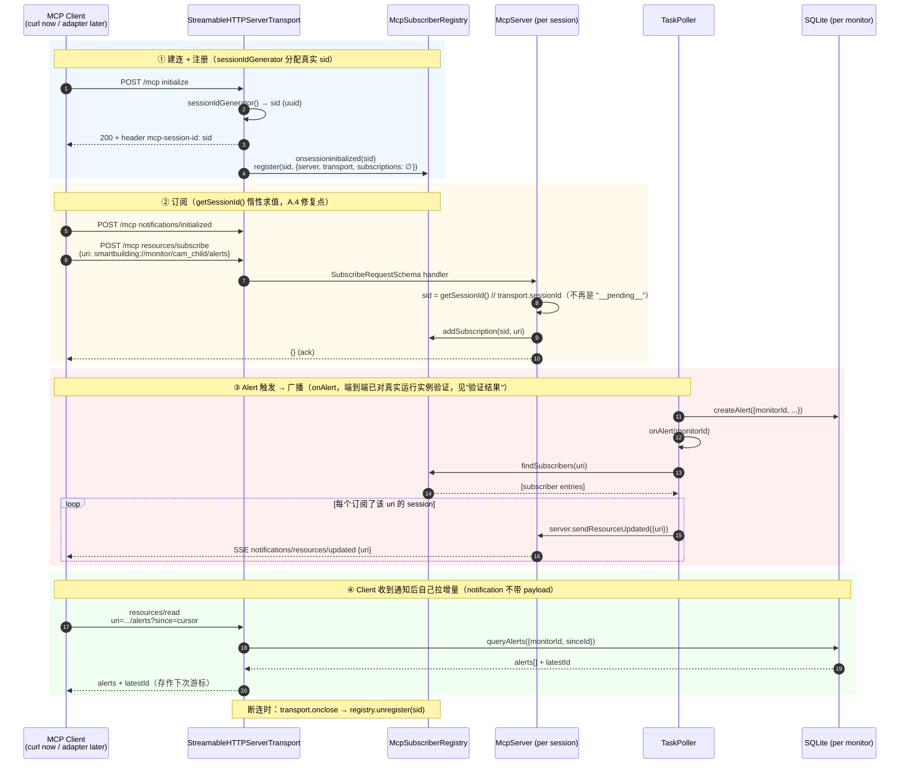

# MCP Subscription 开发状态

**分支**: `jiao/mcp-subscription`
**Plan 源文档**: [docs/dev/plans-backup/MCP-resource-subscription-plan.md](plans-backup/MCP-resource-subscription-plan.md) （原 rustling-giggling-giraffe 计划文件搬到此路径备份）
**状态日期**: 2026-07-08

---

## 任务背景

`task-poller.ts` 命中 rule 后调用 `db.createAlert()` + `onAlert(monitorId)` callback，但 callback 目前只 `logger.debug`——alert 只落 DB，没有推给任何 agent。目标是**闭环这条通道**，让 alert 通过 MCP `notifications/resources/updated` 协议主动推送给订阅的 host（首个 host 是 OpenClaw；未来可能加 Hermes / Claude Desktop 等）。

### 核心设计约束

- **MCP server 完全 host-agnostic**——不知道 OpenClaw、不知道 Feishu、不知道 session
- MCP server 只发协议标准的 `notifications/resources/updated`；notification 只带 uri，不带 payload——client 收到后自己 `resources/read` 拉最新
- 每个 agent framework 写一个 **framework adapter**（长活进程）——内含通用 MCP client + 该 framework 特定的 session 注入逻辑
- 通用 MCP client 部分抽成 `packages/framework-adapter-sdk/` workspace 包
- **不做 persona 润色**——adapter 直接投递 raw alert 到 session
- **路由表**（monitor → session[] 映射）**放 adapter 侧**（如 OpenClaw plugin 自己配），MCP server 不知道 session 概念
- 首个语言目标 **TypeScript**（MCP server 是 TS，OpenClaw 扩展是 TS）
- Cooldown 分层：L1 业务 cooldown 在 MCP server rule engine（已存在）／L2 投递去重在 SDK cursor（天然）／L3 渠道节流在 adapter sink 内部（可选）

### 命名约定（避免歧义）

- **Framework Adapter**（本任务）：让 agent framework 接 MCP alert 的桥。SDK + 每个 framework 一个具体实现
- **Use Case Adapter**（已存在，不属本任务）：`use_case_dict` + `evaluate_rules_path` Python override 那套
- **MCP session**：client↔server 协议连接（有 sessionId）——本任务 `McpSubscriberRegistry` 里的"session"是这个
- **OpenClaw session**：agent 会话如 `agent:<id>:main`——adapter sink 投递的目标

---

## 架构一览

```
┌─────────────────────────────┐         ┌─────────────────────────────┐
│  MCP server (existing TS)   │         │  Adapter (per framework)    │
│  packages/mcp-server        │         │                             │
│                             │◀────────│  Long-lived process         │
│  task-poller → createAlert  │  MCP    │  ┌────────────────────────┐ │
│      ↓                      │  over   │  │ SmartBuildingAdapter   │ │
│  onAlert(monitorId)         │  HTTP   │  │  (framework-adapter-sdk)│ │
│      ↓                      │  (SSE)  │  │  - MCP client          │ │
│  server.sendResourceUpdated │────────▶│  │  - subscribe/reconnect │ │
│  ({ uri: '.../alerts' })    │         │  │  - dedup by cursor     │ │
│                             │         │  └──────────┬─────────────┘ │
│  resources.ts               │◀────────│             │ sink.push()   │
│  read alerts (since cursor) │  read   │             ▼               │
│                             │────────▶│  ┌────────────────────────┐ │
└─────────────────────────────┘         │  │ AlertSink (framework)  │ │
                                        │  │  - reads route table   │ │
                                        │  │  - injects into session│ │
                                        │  └────────────────────────┘ │
                                        └─────────────────────────────┘
```

---

## 运行时订阅时序图（当前实现，A.4 修复后）

`packages/framework-adapter-sdk/` 还没建（Phase B），下图里的 Client 是任何走 MCP 协议的客户端（目前用 curl 手工验证；未来是 adapter 里的 MCP client）。



---

## 当前进度

### ✅ Phase A.1 完成 — `McpSubscriberRegistry`

**文件**: [packages/mcp-server/src/mcp-subscriber-registry.ts](../../packages/mcp-server/src/mcp-subscriber-registry.ts)

维护 sessionId → `{ server, transport, subscriptions: Set<uri> }` 映射。核心方法：
- `register(sessionId, entry)` / `unregister(sessionId)`
- `addSubscription(sessionId, uri)` / `removeSubscription(sessionId, uri)`
- `findSubscribers(uri): SubscriberEntry[]` — onAlert 广播用
- transport 允许 `null`（stdio 单例情况）

### ✅ Phase A.2 完成 — DB cursor 读

**文件**: [packages/db/src/database.ts](../../packages/db/src/database.ts) 已 rebuild（`npm -w @smartbuilding-video/db run build` 通过）

- `queryAlerts` 加 `sinceId?: number` 参数：`AND id > ? ORDER BY id ASC` 分支
- 新增 `getLatestAlertId(monitorId?)` — 返回 `COALESCE(MAX(id), 0)`，无 row 时返回 0

### ✅ Phase A.3 完成 — resources.ts subscribe 支持

**文件**: [packages/mcp-server/src/resources.ts](../../packages/mcp-server/src/resources.ts)

改动要点：
- 拆成两个 template（`ResourceTemplate` 的 `?since` 是 required 不是 optional，所以要两个）：
  - `smartbuilding://monitor/{id}/alerts` → 最新 20 条 + `latestId`
  - `smartbuilding://monitor/{id}/alerts{?since}` → id > since 的增量 + `latestId`
  - **注册顺序**：带 `?since` 的模板必须先注册（SDK 按插入顺序匹配）
- Response body 里包含 `latestId` 字段供 client 存作下次游标
- Subscribe/unsubscribe handler via `server.server.setRequestHandler(SubscribeRequestSchema, ...)`
- Advertise capability via `server.server.registerCapabilities({ resources: { subscribe: true } })`（McpServer 默认只 set `listChanged`）

**当前签名**: `registerResources(server, config, db, registry?, getSessionId?: () => string)` — 已改成惰性求值回调（见下方"已完成"小节），不再是静态字符串。

### ✅ Phase A.4 完成 — index.ts stateful HTTP + onAlert 广播（`getSessionId` 回调路线）

**文件**: [packages/mcp-server/src/index.ts](../../packages/mcp-server/src/index.ts)

**实现完成**：
- `subscriberRegistry` 实例化 (line 102)
- `onAlert` broadcast 实现 (line 106-118) — 遍历 subscribers 调 `server.server.sendResourceUpdated({ uri })`
- Stateful HTTP handler 骨架 (line 123-197)：
  - `sessionIdGenerator: () => randomUUID()`
  - `onsessioninitialized` 里 `subscriberRegistry.register(sid, ...)`
  - 后续 request 从 `mcp-session-id` header 找已有 entry 复用其 transport
  - `transport.onclose` 里 unregister
- stdio 单例登记进 registry（固定 sid `"stdio"`, transport=null）(line 199-208)
- **`getSessionId` 回调路线已落地**（`resources.ts` + `index.ts` 三处调用点：HTTP `() => transport.sessionId ?? "__pending__"`、stdio `() => STDIO_SESSION_ID`）：subscribe/unsubscribe handler 在 handler 触发时才调 `getSessionId()`，不再在 server 构造时把 `"__pending__"` 字符串固化死，修复了原来 `addSubscription("__pending__", uri)` 永远打不中真实 registry entry、notification 永远收不到的 bug。
- 闭包引用未声明的 `server`（TDZ）问题：保持原结构未动——`onsessioninitialized` 只在 `initialize` handshake 时触发，一定晚于 `const server` 声明，runtime 不会撞 TDZ。跑通验证见下方。

**验证结果**（2026-07-08）：
- `npm -w @smartbuilding-video/db run build` ✅
- `npx tsc --noEmit -p packages/mcp-server` ✅（无报错）
- `npm -w @smartbuilding-video/mcp-server run build` ✅
- 手工 curl smoke test（`--http`, `LOG_LEVEL=debug`）：initialize → 拿到真实 `mcp-session-id` → `notifications/initialized` → `resources/subscribe` (`smartbuilding://monitor/cam_child/alerts`) → server debug 日志打印 **`session=<真实uuid> subscribed to ...`**（不是 `__pending__`），证明 registry 里记录的是同一个真实 sid，修复生效。
- **`onAlert` → SSE 全链路：已跑通**（2026-07-08，对着用户真实运行中的实例验证，非临时 smoke 实例）：
  - 目标进程：`tsx packages/mcp-server/src/index.ts --http --config config.yaml.example --monitors monitor_cam_child.yaml`（PID 2474493，监听 3100/3101），配合用户自建的 videostream mock（:8999，定时推片段到 3101）。
  - 步骤：`initialize` 拿到真实 `mcp-session-id` → `notifications/initialized` → `resources/subscribe {uri: smartbuilding://monitor/cam_child/alerts}` → 后台开一个 `curl -N GET /mcp`（同 session-id header）保持 SSE 长连接 → 记录基线 `SELECT ... FROM alerts ... ORDER BY id DESC LIMIT 1` 为 `id=4`。
  - 结果：管线自然产生了 3 条新 alert（id 5/6/7，`climb: critical` × 2、`jump: warn` × 1），SSE 流原样收到 3 条 `{"method":"notifications/resources/updated","params":{"uri":"smartbuilding://monitor/cam_child/alerts"}}`。随后用同一 session 发 `resources/read?uri=...&since=4`，正确返回 id 5-7 的完整 alert 内容（含 `description`、`createdAt`）与新的 `latestId: 7`。
  - 结论：subscribe → 真实告警触发 → SSE 推送 → 客户端按 cursor 拉增量，全链路验证通过，且是自然触发（未手工 INSERT），比 Phase C 单测更接近真实场景。Phase C 单测仍值得补（覆盖 registry 边界情况，如断连重连、多 session 并发订阅），但不再是"未覆盖"的 gap。

### ✅ Phase B 完成 — `packages/framework-adapter-sdk/`（通用 MCP client SDK）

**目录**: [packages/framework-adapter-sdk/](../../packages/framework-adapter-sdk/)

- `package.json` — workspace 包 `@smartbuilding-video/framework-adapter-sdk`；deps `@modelcontextprotocol/sdk` + `@smartbuilding-video/db`（仅 type）；`exports` 同时暴露根入口与 `./cursor` 子路径（对齐 plan §3.2 的 import）
- `tsconfig.json` — 对齐 sibling（`Node16` module + `composite`，**编译成 CJS**，与 db/mcp-server 一致，MCP SDK 有 `require` 构建可 interop）
- `.npmignore` — 排除 `src/` `examples/` `tests`
- `src/types.ts` — `AlertPayload` / `AlertSink`（at-least-once + 幂等契约）/ `CursorStore` / `Logger` / `ReconnectConfig` / `TransportConfig` / `AdapterConfig`；`Alert` 直接从 `@smartbuilding-video/db` 复用
- `src/cursor.ts` — `MemoryCursorStore`（Map）+ `FileCursorStore`（JSON 文件，内存缓存 + temp-file+rename 原子写 + 跨 monitor 写串行化）
- `src/adapter.ts` — `SmartBuildingAdapter`：
  - `start()` connect → **先 subscribe 再首读**（避免启动窗口丢 notification，cursor 去重 overlap）→ 每 monitor seed/resume
  - 单一 `syncMonitor()` 交付路径：cursor===null → seed 到 latestId 跳历史；cursor!==null → 读 `?since=cursor` → 升序 push → 全部成功后原子推进 cursor（中途失败整批重放 = at-least-once）
  - notification handler + optional poll fallback（`pollFallbackMs`，默认 0）都走同一 `runExclusive` **per-monitor mutex**
  - 断连重连：指数退避（1000/30000/2）+ **generation guard**（旧 transport handler 失效不误触发重连）
  - `stop()` 清 timer + unsubscribe + close，best-effort 幂等
- `src/index.ts` — 导出 `SmartBuildingAdapter` / `MemoryCursorStore` / `FileCursorStore` + 全部 type
- **build 验证**：`npm run build`（全 workspace）✅ 零错误；dist 输出 CJS

### ✅ Phase C 完成 — `tests/framework-adapter-sdk/` 单测

**目录**: [tests/framework-adapter-sdk/](../../tests/framework-adapter-sdk/)（与既有 `tests/dev-mcp-server/` 同层）

- **测试运行器**：Node 内建 `node:test` + `tsx`（无额外测试框架依赖）；root `package.json` 加 `test:sdk` 脚本 `node --import tsx --test tests/framework-adapter-sdk/*.test.ts`
- `fixtures/mock-mcp-server.ts` — 自包含 mock，**跑真实 Streamable-HTTP transport**（非 stub client）：stateful HTTP session、`alerts{?since}` resource、subscribe/unsubscribe、`sendResourceUpdated` 广播；测试钩子 `fireAlert` / `addAlertSilently` / `dropConnections`；未知/过期 session 返回 404（让 client SSE 重试耗尽后 surface error）
- `adapter.test.ts` — 7 个场景全绿：seed 跳历史 / 突发去重保序（coalescing+debounce）/ 跨摄像头独立 / **FileCursorStore 重启不重放 + 补投递** / **断连重连补投递** / poll fallback 兜底 / **sink 失败不推进游标（at-least-once 重放）**
- `README.md` — 运行方式 + 覆盖表 + fixture 钩子说明
- 验证：`npm run test:sdk` → **7 pass / 0 fail**；`npx tsc --noEmit` 测试+fixture 零类型错误；`npm run build` 全 workspace 通过

**测试发现并修复的真实 adapter bug**：`StreamableHTTPClientTransport` 自带 SSE 重连（`maxRetries=2`），耗尽后触发的是 **`onerror` 而非 `onclose`**。原 adapter 的 `onerror` 只 log 不重连 → server bounce 后永不恢复。已修：`onerror` 也走 `handleDisconnect`，加 `reconnecting` 标志去重 onclose/onerror pair。

### ✅ Phase D 完成 — `packages/framework-adapter-sdk/examples/openclaw/`（OpenClaw 参考 plugin）

**目录**: [packages/framework-adapter-sdk/examples/openclaw/](../../packages/framework-adapter-sdk/examples/openclaw/)（在 SDK 包内，被 `.npmignore` 排除，非 workspace 成员）

- `index.ts` — `definePluginEntry`：parse config → 建 `SmartBuildingAdapter`（FileCursorStore 落 `<OPENCLAW_HOME>/smartbuilding-alerts-cursor.json`）→ `registerService`（start/stop 绑 gateway 生命周期）
- `api.ts` — re-export `openclaw/plugin-sdk/plugin-entry`（同 smarthome-video；`openclaw` 由 gateway bundle 期提供，不是 repo 依赖）
- `openclaw.plugin.json` — metadata + configSchema（monitor-centric，`monitors.<id>.alerts[]` flow-key）
- `src/config.ts` — 校验/规整 `api.pluginConfig`
- `src/sink.ts` — OpenClaw `AlertSink`：`deliver:false` → 原生 FS-append 两行（零 LLM）；`deliver:true` → `subagent.run({deliver:true, extraSystemPrompt: verbatim relay, idempotencyKey})`
- `src/format.ts` — `formatSeparator` + `formatAlert`（raw pass-through，无 persona；severity/event 用防御性 cast 探测，base Alert 无这些字段）
- `src/session-append.ts` — vendored 自 smarthome-video `appendAlertGroupToMainSession`，带 `TODO(migrate)`；写 user+assistant 两行（controlUI same-role 合并约束）
- `agents/` — 硬拷贝 3 个 agent 全部 persona `.md`（child-safety / elder-wakeup / fridge-en），自包含
- `install.sh` — build SDK + `npm install` + symlink 进 `~/.openclaw/extensions/` + `cp -n` personas + 打印 openclaw.json snippet（幂等）
- `README.md` — 单页安装 + 配置 + 原理
- **验证**：SDK 依赖的 4 文件（config/format/session-append/sink）`tsc --noEmit` 零错误；index.ts/api.ts 依赖 openclaw 包，由 gateway bundler 校验（同 smarthome-video，无 repo build）；example 不进 workspace build、不进发布包

### ✅ Phase E 完成 — `docs/framework-adapters/*.md`

[docs/framework-adapters/](../framework-adapters/README.md)：`README.md`（架构+协议流程+两层+cooldown 分层+何时用 adapter vs webhook）/ `deployment.md`（MCP server stateful HTTP 清单 + adapter 部署形态 + cursor + 排障表）/ `writing-a-new-framework-adapter.md`（5 步指南）/ `openclaw.md`（参考实现走读）

### ✅ Phase F 完成 — status 文档更新

`docs/dev/dev_status.md` WW27 三条订阅项勾掉 + 新增 adapter SDK/example/docs 条目；本文件全程同步。

### ✅ install.sh 完备度补齐（全自动化，2026-07-15）

`packages/framework-adapter-sdk/examples/openclaw/install.sh` 原本 build+symlink+persona 后打印
snippet 让用户手工编辑 openclaw.json / 手工重启 / 手工唤醒。已改为全自动、幂等、非破坏：

- **注册 plugin entry**：`openclaw config get plugins.entries.smartbuilding-alerts` 探测，缺失才
  `openclaw config patch --file`（JSON5，对象递归 merge + 写前校验，不动 minimax/tavily）。已存在则跳过，保留手工改过的 monitors/mcpServer。
- **合并 agents.list**：`config patch` 对数组是**整体替换**，所以先 `config get agents.list --json`
  读现有（非数组则回退 `[]`），jq **merge-by-id** 只追加缺失的（main + fridge/child/elder），再整块写回；顺带把隐式默认 `main` 收进显式 list。
- **重启**：`openclaw gateway restart`（gateway 是 systemd user service `openclaw-gateway.service`，enabled+active；`daemon` 是 legacy alias）+ 轮询 `gateway status` 的 `Connectivity probe: ok` 直到就绪（~30s 超时）。非 service 环境降级为提示手工 `openclaw gateway run` / `--force`。
- **唤醒**：`openclaw agent -m "hi" --agent <id>` 依次唤醒三个 persona agent。
- 环境变量：`OPENCLAW_HOME` / `MCP_URL` / `AGENT_MODEL` / `SKIP_RESTART=1` / `SKIP_WAKEUP=1`。
- 依赖前置检查：`openclaw` + `jq` 缺失即报错退出。merge/patch 逻辑已对 live config（4 agent 已存在 → added=0）与 fresh（空 list → 全加，`${HOME}` 占位符原样保留）两条路径验证。

### ✅ 会话投递迁移到 2026.7.1 一等 transcript API（2026-07-15）

机器已升级 openclaw 2026.7.1（`openclaw --version`）。deliver:false 的会话注入从手工 FS-append hack
迁到官方 plugin-SDK API，deliver:true 结构统一：

- **统一注入原语**：`sink.ts` 两条路共用一个 `appendToSession`（`src/inject-types.ts` 里的
  `SessionAppender`）。`deliver` 不再选"用哪套机制"，只决定是否**额外**推外部渠道。
- **新实现 `src/session-inject.ts`**：`withSessionTranscriptWriteLock` 一把锁内 append 分隔行 + assistant
  行再 `publishUpdate`；sessionId 由 `getSessionEntry` 解析、缺失则 `randomUUID()` +
  `patchSessionEntry({systemSent:true})` 新铸（取代克隆 `:main`）。SDK 负责 header 创建 / parentId 链接 /
  写锁 / 幂等 / UI 事件。
- **真幂等**：`message.idempotencyKey` + `idempotencyLookup:"scan"`，key = `sb-alert:<mon>:<id>`，分隔行与
  正文用不同后缀（`:sep`/`:body`，否则第二行会被当重复跳过）。修掉旧 FS-append"崩溃重放会重复追加"的问题。
- **6.9 回退**：`session-inject.ts` 用**动态 import** `openclaw/plugin-sdk/session-transcript-runtime`
  + `.../session-store-runtime`，try/catch；旧 gateway import 失败 → `index.ts` 回落到 legacy
  `session-append.ts`（纯 node fs，无 openclaw 依赖）。选择在 service `start()` 里做，打一行日志说明走哪条。
- **deliver:true**：本批保留 `subagent.run` 逐字转发（其 ephemeral turn 已把消息记进该 session，故 **不**再
  额外 `appendToSession` 以免重复记录）。无 LLM 渠道直发（`plugin-sdk/channel-outbound`）= 后续选项 B。
  已排除 `sessions.send`/`session.message`（核实会经 `chat.send` 拉起接收方 agent turn = LLM）。
- **类型校验边界**：`config/format/inject-types/session-append/sink` 5 文件 `tsc --noEmit` 干净；
  `session-inject.ts`（字面量动态 import openclaw，bundler 需字面量才能 externalize）与 `index.ts`/`api.ts`
  一样归 bundler 校验。SDK workspace `npm run build` 通过。

### ✅ deliver:false 误投 :main 的 bug 修复（2026-07-16）

**症状**：deliver:false 可投递，但所有 alert 都进了 `agent:<id>:main`，而不是配置的
`agent:child-safety-agent:cam_child` 等 per-source session。三个 per-source monitor 全中招。

**根因**：**stale `sessionFile`**。新 transcript API 的 `resolveSessionTranscriptRuntimeTarget`
是从 store entry 的 **`sessionFile` 字段**解析要写的文件的，即使它和 `sessionId` 不一致也照单全收。
而 legacy `session-append.ts::resolveOrCreateSessionId` 当年铸 per-source session 时是
**克隆 `:main` entry**（`{...mainEntry, sessionId: newSid}`）——把 `:main` 的 `sessionFile` 一起复制了。
legacy append 自己按 `sessionId` 拼路径、无视该字段（所以 6.9 时代写对了），但迁到 transcript API 后
该字段被信任 → 每条 alert 写进 `:main` 的 jsonl。实测：plugin 日志 `sid=ae271ed9`（cam_child，对的），
但内容落在 `6c541876.jsonl`（main）；`cam_child` entry 的 `sessionFile` 指向 `6c541876…jsonl`。

**修复**（`~/.openclaw/extensions/smartbuilding-alerts` 是仓库 symlink，改仓库即改 runtime）：
- `src/session-inject.ts`：解析/铸 session 时**把 entry 的 `sessionFile` 钉到该 `sessionId` 的规范路径**
  （`agents/<agentId>/sessions/<sessionId>.jsonl`），不一致就 `patchSessionEntry` 修（自愈已污染的 entry）。
  顺带修掉原铸新代码把 `patchSessionEntry.update` 当**对象**传的潜伏 bug——它必须是 **patch 回调**
  `(entry)=>Partial`（原代码因 entry 已存在从没走到铸新分支，所以一直没暴露；本次自愈分支触发才崩
  `params.update is not a function`）。
- `src/session-append.ts`：legacy 克隆 `:main` 时显式 `sessionFile: newJsonl`，杜绝旧 gateway 上再污染。
- **实机验证**（2026-07-16，rewind cursor 重放 cam_child 321/324/327）：日志打
  `repaired session … file=ae271ed9….jsonl`；`ae271ed9.jsonl`(cam_child) 8→14 行（3 alert×2 行），
  `6c541876.jsonl`(main) 保持 136 行不变；`cam_child` entry 的 `sessionFile` 已修正指向自身。
  两个 elder session 的 entry 仍带旧 `sessionFile`，会在下一条新 alert 到来时按同一路径自愈。

### ⏳ 剩余（需实机）

- feishu channel（deliver=true）端到端验证；无 LLM 渠道直发（选项 B）调研
- ControlUI 实时刷新 + 幂等不重复的 UI 侧复验（注入链路已验证正确）
- **副带发现（未修，另立项）**：injector 把注入失败吞成 `ok:false` 返回而非 throw，导致 sink 失败时
  SDK cursor 仍推进（at-least-once 在"注入失败"这一路被短路）。routing bug 修复不依赖它，但值得收口。
- 计划详见 `~/.claude/plans/openclaw-2026-7-1-session-api-session-sequential-scroll.md`

---

## 已完成参考：A.4 验证命令

```bash
# 1) build 通过
npm -w @smartbuilding-video/db run build && npx tsc --noEmit -p packages/mcp-server

# 2) 启动 mcp-server HTTP（config.yaml/monitors.yaml 可省略，全部走默认值）
LOG_LEVEL=debug SMARTBUILDING_DATA_DIR=/tmp/mcp-smoke-test node packages/mcp-server/dist/index.js --http

# 3) curl 手工验证 subscribe 流程（已跑通，见上方"验证结果"）
#    - initialize 返回带 mcp-session-id header
#    - notifications/initialized
#    - 用同一 sid 发 resources/subscribe { uri: 'smartbuilding://monitor/cam_child/alerts' }
#    - debug 日志应打印 `session=<真实uuid，非 __pending__> subscribed to ...`
#
# 4) onAlert 广播全链路（已对着真实运行实例跑通，见上方"验证结果"）：
#    注意手工 SQL INSERT 一条 alert 不会触发 onAlert——它只在 task-poller 完成
#    db.createAlert() 后于同进程内直接调用，不是 DB trigger。要验证 sendResourceUpdated
#    真正送达 SSE，必须让 videostream-analytics + summary service + rule engine 真实产生
#    一条 alert（或对真实运行中的实例订阅后等待自然触发，本次即用此法验证）。
#
# 手动订阅 + 观察 alert 推送的完整 recipe（不需要额外起进程，直接对已运行的 mcp-server 操作）：

# 1. initialize（第一条 curl）
# 告诉服务器"我是一个新客户端，我们建立连接吧"。服务器会分配一个 session id，放在响应的 mcp-session-id 这个 HTTP 响应头里返回给你。这条命令用 -D -（打印响应头）配合 grep/cut，把这个 id 抠出来存进 $SID 变量。这一步之后你才有 $SID 可用。
SID=$(curl -sS -D - -o /tmp/init_body.json -X POST http://localhost:3100/mcp \
  -H "Content-Type: application/json" -H "Accept: application/json, text/event-stream" \
  -d '{"jsonrpc":"2.0","id":1,"method":"initialize","params":{"protocolVersion":"2024-11-05","capabilities":{},"clientInfo":{"name":"manual-verify","version":"1.0"}}}' \
  | grep -i mcp-session-id | tr -d '\r' | cut -d' ' -f2)

# 2. notifications/initialized（第二条 curl）
# MCP 协议握手的收尾确认，格式上必须发，告诉服务器"初始化完成了"。不发这条，后面的订阅可能被服务器拒绝或行为不确定。
curl -sS -X POST http://localhost:3100/mcp -H "Content-Type: application/json" \
  -H "Accept: application/json, text/event-stream" -H "mcp-session-id: $SID" \
  -d '{"jsonrpc":"2.0","method":"notifications/initialized"}'

# 3. resources/subscribe（第三条 curl）
# 真正的订阅动作：告诉服务器"以后 smartbuilding://monitor/cam_child/alerts 这个资源有更新，请通知我这个 session（$SID）"。服务器内部会把 $SID 记到 McpSubscriberRegistry 里。
curl -sS -X POST http://localhost:3100/mcp -H "Content-Type: application/json" \
  -H "Accept: application/json, text/event-stream" -H "mcp-session-id: $SID" \
  -d '{"jsonrpc":"2.0","id":2,"method":"resources/subscribe","params":{"uri":"smartbuilding://monitor/cam_child/alerts"}}'

# 4. GET /mcp（另开一个终端，保持长连接监听推送（同一个 $SID）
# 这不是发请求，而是打开一条长连接（SSE），用同一个 $SID 告诉服务器"我在这条连接上等你推送"。当 cam_child 有新 alert 时，服务器会通过这条连接主动推 notifications/resources/updated 消息过来 —— 这就是你要的"终端接收 alert 推送"。
curl -sS -N -X GET http://localhost:3100/mcp -H "Accept: text/event-stream" -H "mcp-session-id: $SID"
# 一旦有新 alert 产生，这里会收到：
#   event: message
#   data: {"method":"notifications/resources/updated","params":{"uri":"smartbuilding://monitor/cam_child/alerts"},"jsonrpc":"2.0"}

# 如果你现在已经确认 3100 端口的服务在跑且 alert 会持续产生，你只需要顺序执行这4条（1、2、3 在同一个终端跑完，然后开第二个终端跑 4），就能实时看到推送。收到推送后如果想看具体 alert 内容，再用第5条 resources/read?since=<上次的id> 拉详情。
# 收到通知后（通知本身不带 payload），用同一 $SID 按 cursor 拉增量内容：
curl -sS -X POST http://localhost:3100/mcp -H "Content-Type: application/json" \
  -H "Accept: application/json, text/event-stream" -H "mcp-session-id: $SID" \
  -d '{"jsonrpc":"2.0","id":3,"method":"resources/read","params":{"uri":"smartbuilding://monitor/cam_child/alerts?since=<上次的 latestId>"}}'

# 初次查阅：先不带 ?since，直接读一次基础 URI
curl -sS -X POST http://localhost:3100/mcp -H "Content-Type: application/json" \
  -H "Accept: application/json, text/event-stream" -H "mcp-session-id: $SID" \
  -d '{"jsonrpc":"2.0","id":3,"method":"resources/read","params":{"uri":"smartbuilding://monitor/cam_child/alerts"}}'

```

---

## Todo 全量（新 session 直接复制到 TodoWrite）

```
[completed]  Phase A.1: create packages/mcp-server/src/mcp-subscriber-registry.ts
[completed]  Phase A.2: db.queryAlerts() add sinceId param
[completed]  Phase A.3: resources.ts parse ?since= + subscribe/unsubscribe handlers + return latest_id
[completed]  Phase A.4: index.ts switch HTTP to stateful, register subscriber registry, implement onAlert broadcast (getSessionId callback route)
[completed]  Phase A.5: build packages/mcp-server + smoke curl verify subscribe registers real sid (not __pending__); onAlert→SSE full-chain verified live against user's running instance (3 naturally-fired alerts pushed + since= delta read confirmed)
[completed]  Phase B.1: scaffold packages/framework-adapter-sdk (package.json / tsconfig / .npmignore)
[completed]  Phase B.2: SDK types.ts (AlertSink, AlertPayload, AdapterConfig, CursorStore)
[completed]  Phase B.3: SDK cursor.ts (MemoryCursorStore + FileCursorStore)
[completed]  Phase B.4: SDK adapter.ts (SmartBuildingAdapter: subscribe / notification handler / per-monitor mutex / reconnect / poll fallback)
[completed]  Phase B.5: SDK build clean
[completed]  Phase C.1: tests/framework-adapter-sdk fixtures + mock MCP server
[completed]  Phase C.2: SDK unit tests (basic + coalescing + concurrency + cross-monitor + poll fallback + cursor persistence + reconnect + at-least-once)
[completed]  Phase D.1: scaffold examples/openclaw (package.json / openclaw.plugin.json / index.ts / api.ts)
[completed]  Phase D.2: vendor session-append.ts from smarthome-video (with TODO migrate)
[completed]  Phase D.3: sink.ts + format.ts + config.ts
[completed]  Phase D.4: seed agents/ from smarthome workspace (hard-copy .md files)
[completed]  Phase D.5: install.sh (build + symlink + persona cp -n + json snippet)
[completed]  Phase D.6: README.md (single-page install guide)
[completed]  Phase E: docs/framework-adapters/{README,deployment,writing-a-new-framework-adapter,openclaw}.md
[completed]  Phase F: dev_status.md check off line 185-186 and add adapter items
```

---

## 关键上下文引用（新 session 冷启动可读）

- **CLAUDE.md 项目概览**：`/home/mytest/agent-ai.smart-community-ai-automation/CLAUDE.md` （如果有）+ smarthome 项目的 `/home/mytest/agent-ai.smarthome/CLAUDE.md`（很详细，尤其是 OpenClaw 相关设计）
- **原始 plan 文件**：`docs/dev/plans-backup/MCP-resource-subscription-plan.md`（源自 `~/.claude/plans/rustling-giggling-giraffe.md`）
- **AlertCallback 已有定义**：[packages/mcp-server/src/video-worker/index.ts:13](../../packages/mcp-server/src/video-worker/index.ts#L13)
- **onAlert 现状**：在 [index.ts](../../packages/mcp-server/src/index.ts) 已经改写完毕，A.4/A.5 已完成（`getSessionId` 回调路线 + curl smoke test 验证）
- **保序 & 抗错乱设计**：跨摄像头（uri 分片）、同摄像头（AUTOINCREMENT id + ORDER BY id + adapter 端 per-monitor mutex）、coalescing/丢失（since 游标 + optional 兜底轮询默认关闭）
- **OpenClaw raw-append API 现状**（2026-07-15 重新调研，对比 npm tarball 6.9 vs 7.1）：
  - **installed = 2026.6.9**（`openclaw --version`），**latest = 2026.7.1**（`npm view openclaw version`；dist-tags latest=2026.7.1, beta=2026.7.1-beta.6）。当前 gateway 仍是 6.9（systemd `openclaw-gateway.service`）。
  - **6.9（安装版）：仍无一等 by-identity raw-append**。plugin-sdk 只导出低层 `appendSessionTranscriptMessage({ transcriptPath, message, idempotencyLookup, ... })`（via `./plugin-sdk/agent-harness-runtime`），需自己解析 transcript JSONL 路径、且**没有** by-sessionKey 解析器、也没有 ControlUI update publisher。CLI 侧无 append/inject 命令（`message send`=出站渠道；`sessions`=cleanup/compact/export/list/tail；`agent`=跑一整个 model turn）。→ 结论：smarthome-video / 本 example 的 FS-append hack 在 6.9 下仍是必需。
  - **7.1（最新）：已graduate 成一等 API**。新增 plugin-sdk 子路径 **`./plugin-sdk/session-transcript-runtime`**，提供 by-identity（agentId / sessionKey / sessionId）全套：
    - `appendSessionTranscriptMessageByIdentity(params)` — 解析 target + 幂等 + 写锁后 append，**正是 raw-append 要的**（无 model turn）。
    - `appendAssistantMirrorMessageByIdentity(...)` — assistant-mirror 变体。
    - `publishSessionTranscriptUpdateByIdentity(...)` — 发 ControlUI transcript update（替代 hack 里手工 `emitSessionTranscriptUpdate`）。
    - `resolveSessionTranscriptTarget` / `resolveSessionTranscriptIdentity` / `resolveSessionTranscriptLegacyFileTarget`（不用再手拼 JSONL 路径）、`withSessionTranscriptWriteLock`、`readSessionTranscriptEvents` / `readLatestAssistantTextByIdentity`。
    - 校验：6.9 tarball `appendSessionTranscriptMessageByIdentity` 命中 0、不导出 `session-transcript-runtime`；7.1 tarball 两者都有。
  - **→ migration 结论**：`packages/framework-adapter-sdk/examples/openclaw/src/session-append.ts` 的 `TODO(migrate)` 现在有落点了——**升级 gateway 到 2026.7.1** 后，可用 `appendSessionTranscriptMessageByIdentity` + `publishSessionTranscriptUpdateByIdentity` 替换 vendored FS-append hack（幂等/写锁/UI-update 都由 SDK 负责，user+assistant 两行的 same-role 合并 workaround 也可去掉）。升级前 6.9 下维持现状 hack。
- **example plugin 部署原则**：0 成本——install.sh 一键 build + symlink + cp 硬拷贝进 example 的 agent personas 到 `~/.openclaw/agents/`（`cp -n` 幂等），提示用户粘贴 openclaw.json snippet + 重启 gateway
