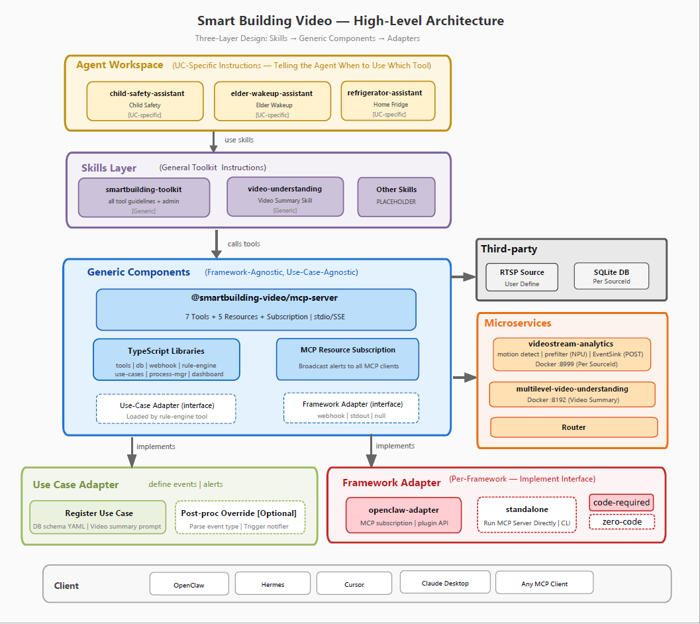
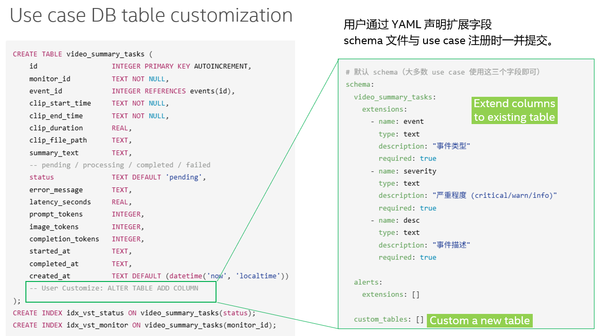
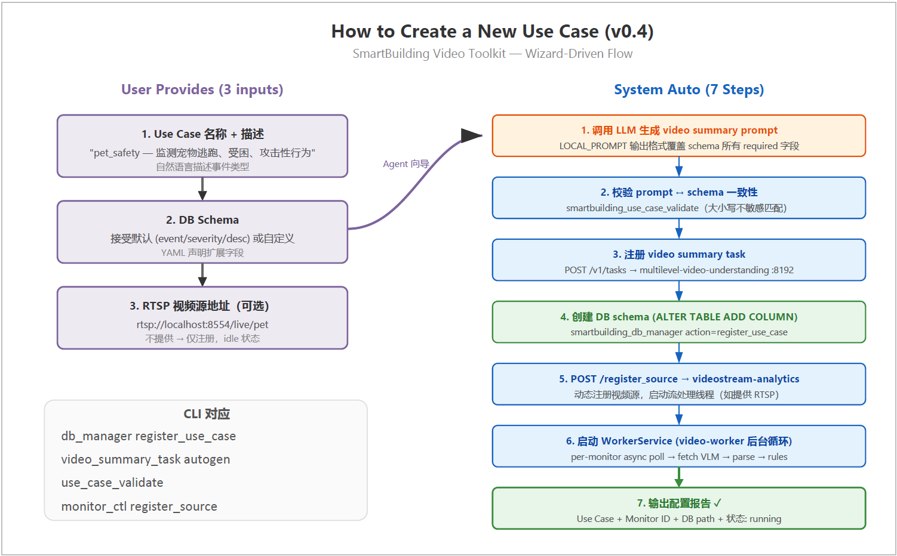
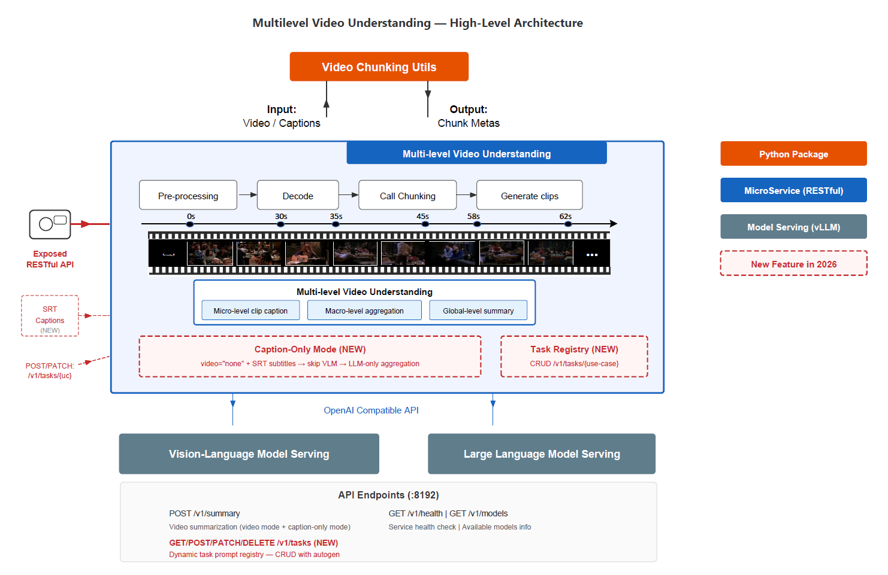
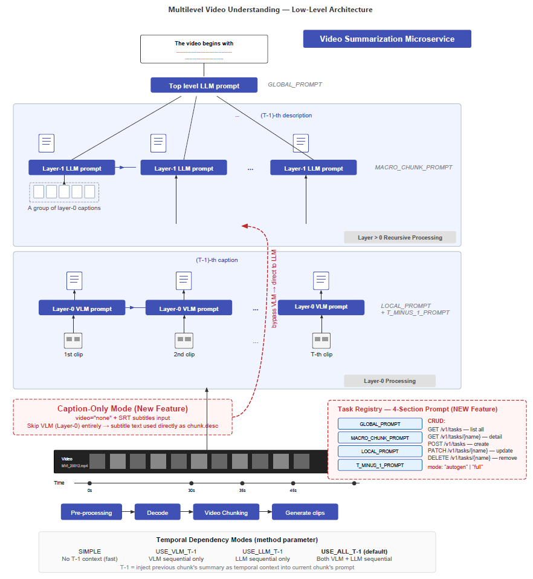
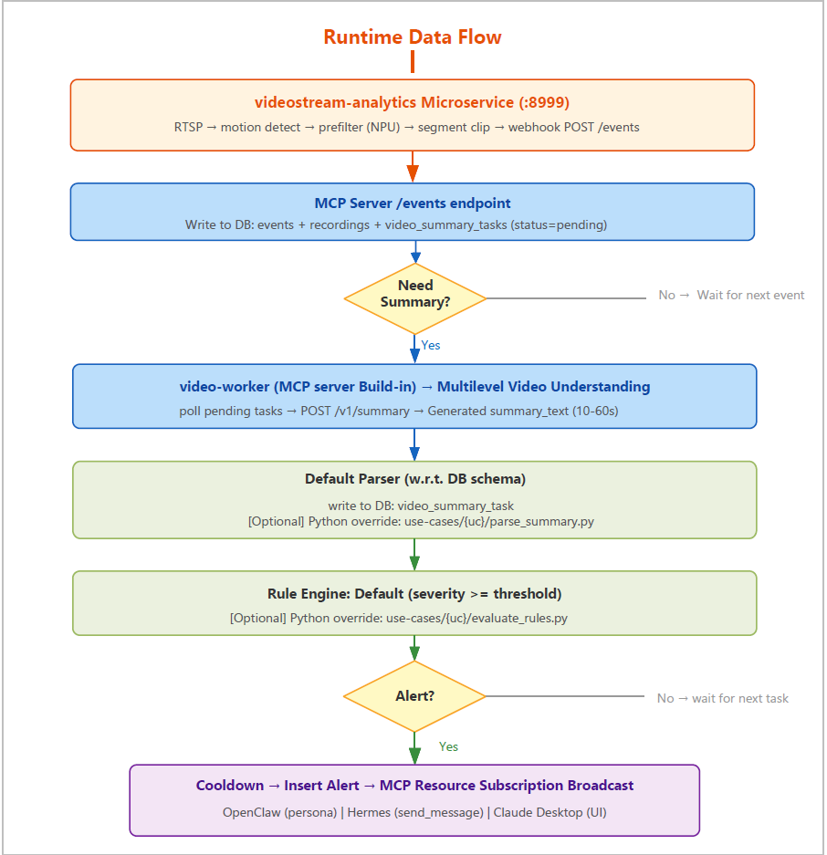

# Smart Building Video Analytics — Design Document 2026.2

| Field | Value |
|-------|-------|
| **Document ID** | SBV-DESIGN-2026.2 |
| **Version** | 0.4 |
| **Status** | Final |
| **Date** | 2026-06-08 |
| **Authors** | Smart Building Video Team |

---

## Table of Contents

1. [Introduction](#1-introduction)
2. [Overall Architecture](#2-overall-architecture)
3. [SmartBuilding Video MCP Server](#3-smartbuilding-video-mcp-server)
4. [Agent Framework Adapter](#4-agent-framework-adapter)
5. [Use Case Adapter](#5-use-case-adapter)
6. [SmartBuilding Video Skills and Agent Workspace](#6-smartbuilding-video-skills-and-agent-workspace)
7. [Video Stream Analytics Microservice](#7-video-stream-analytics-microservice)
8. [Multi-level Video Understanding Microservice](#8-multi-level-video-understanding-microservice)
9. [Runtime Data Flow](#9-runtime-data-flow)
10. [Deployment Architecture](#10-deployment-architecture)
11. [Integration & Documents](#11-integration--documents)

---

## 1. Introduction

### 1.1 Purpose

本文档描述 Smart Building Video Analytics 系统（v0.4, 2026.2 release）的设计。该系统是一个 **AI Agent 原生的视频分析平台** — 从架构层面为 AI Agent（OpenClaw、Hermes、Claude Desktop、Cursor 等）通过 MCP（Model Context Protocol）操作而设计。它提供通用的、框架无关的视频监控与分析工具集，Agent 可以自主创建、管理和响应自定义用例（儿童安全、老人起床、冰箱监控、宠物安全等），无需人工干预或修改核心组件代码。

### 1.2 Scope

| Feature | Task Breakdown |
|---------|---------------|
| **SmartBuilding Video MCP Server** | MCP Server structure dev, TypeScript library (tools), MCP resource subscription, Support DB schema customization |
| **Agent Framework Adapter** | Agent framework adapter wrapper, OpenClaw adapter: plugin, Standalone MCP client |
| **Use Case Adapter** | Use case adapter wrapper, Register new use case, Customize post-proc (summary-parser / rule engine) |
| **SmartBuilding Video Skills and Agent Workspace** | Skill tuning: smartbuilding-toolkit, Skill tuning: video-understanding, Agent Workspace tuning: child-safety-assistant / elder-wakeup-assistant / refrigerator-assistant (migrate from demo) |
| **Video Stream Analytics Microservice** | Microservice structure dev, Motion detection + NPU Prefilter (migrate from demo), Dynamic video source management |
| **Multi-level Video Understanding Microservice** | Caption only, Dynamic Task, Validation |
| **Integration & Documents** | Integration and bug fix, User guide / Get-started-guide / Developer's guide, E2E Validation |

### 1.3 Design Goals

| 目标 | 说明 |
|------|------|
| Agent 原生 | 所有操作以 MCP tools 形式暴露；Agent 自主创建和管理用例 |
| 框架无关 | 通用组件可被任意 MCP 客户端使用（OpenClaw、Hermes、Claude Desktop、Cursor） |
| 用例无关 | 不硬编码业务逻辑；通过配置 + 可选 Python callback 扩展 |
| 单一微服务 | 一个 `videostream-analytics` 容器动态管理所有视频源 |
| 零代码用例创建 | 交互式向导仅需用户提供 3 个输入即可完成注册 |
| 实时告警 | MCP Resource Subscription 统一推送至所有已连接客户端 |

---

## 2. Overall Architecture

系统采用分层架构设计，从顶层 Agent Workspace 到底层 Client 共 6 层，各层职责明确、解耦。



**Figure 2-1: Smart Building Video Analytics — 整体系统架构**

### 2.1 Layer Responsibilities

| 层 | 职责 | 示例 |
|----|------|------|
| **Agent Workspace** | 用例特定指令 — 告诉 Agent 在该用例下何时使用哪个 tool；每个 workspace 定义一个 assistant 人设 | `child-safety-assistant`（UC-specific）、`elder-wakeup-assistant`（UC-specific）、`refrigerator-assistant`（UC-specific） |
| **Skills Layer** | 通用工具包指令 — 可复用的 skill 定义，提供工具使用指南和管理能力（不绑定具体用例） | `smartbuilding-toolkit`（全部工具指南 + 管理，Generic）、`video-understanding`（视频摘要 Skill，Generic） |
| **Generic Components** | 框架无关、用例无关的核心：MCP Server（7 Tools + 5 Resources + Subscription）、TypeScript 库、MCP Resource Subscription、Use-Case Adapter 接口、Framework Adapter 接口 | `@smartbuilding-video/mcp-server`、`videostream-analytics` |
| **Use Case Adapter** | 为特定用例定义事件和告警：注册用例（DB schema YAML + video summary prompt）+ 可选的后处理 override（解析事件类型、触发通知） | `child_safety`、`elder_wakeup`、`refrigerator_monitor` |
| **Framework Adapter** | 按框架实现 Framework Adapter 接口；`openclaw-adapter` 需要代码（MCP subscription + plugin API），standalone / Hermes / Claude Desktop 零代码（直接运行 MCP Server） | `openclaw-adapter`（需代码）、`standalone`（零代码） |
| **Client** | 终端用户交互的 Agent 框架 / MCP 客户端 | OpenClaw、Hermes、Cursor、Claude Desktop、任意 MCP Client |

### 2.2 Package Structure (Monorepo)

```
smartbuilding-video-toolkit/                    # monorepo root
├── packages/
│   ├── db/                                 # @smartbuilding-video/db
│   ├── rule-engine/                        # @smartbuilding-video/rule-engine
│   ├── tools/                              # @smartbuilding-video/tools
│   ├── process-manager/                    # @smartbuilding-video/process-manager
│   ├── dashboard/                          # @smartbuilding-video/dashboard
│   ├── mcp-server/                         # @smartbuilding-video/mcp-server
│   │   └── src/video-worker/               # Internal async module (per-monitor)
│   └── openclaw-adapter/                   # @smartbuilding-video/openclaw-adapter
├── videostream-analytics/                  # PyPI: videostream-analytics (Python microservice)
├── use-cases/                              # Optional Python callback overrides
└── skills/                                 # Skill definitions (SKILL.md + scripts)
```

### 2.3 核心设计原则

1. **EventSink 抽象** — 将 Python pipeline 与事件消费者解耦，pipeline 发送事件时不关心谁接收
2. **MCP Resource Subscription** — 统一实时告警推送，所有已连接的 Agent 框架通过标准协议接收
3. **配置驱动扩展** — 新增用例仅需配置，无需修改核心组件代码
4. **内置默认 + 可选覆盖** — parser 和 rules 对标准 VLM 输出格式开箱即用；复杂场景可通过 Python callback override

---

## 3. SmartBuilding Video MCP Server

MCP Server 是系统的中枢。它将所有能力以 MCP tools 和 resources 形式暴露，管理 video-worker 循环，接收 pipeline 事件，并通过 MCP Resource Subscription 广播告警。

### 3.1 MCP Server Structure

```
packages/mcp-server/
└── src/
    ├── index.ts                    # MCP server entry (stdio / SSE)
    ├── tools.ts                    # MCP tool registration
    ├── resources.ts                # MCP resource + subscription
    ├── config.ts                   # Configuration loading
    ├── events-endpoint.ts          # /events webhook receiver → DB write
    └── video-worker/               # Embedded video-worker module
        ├── index.ts                # WorkerService — per-monitor async loop
        ├── task-poller.ts          # setInterval polling DB for pending tasks
        ├── vlm-client.ts           # fetch(videoSummaryServiceUrl/v1/summary)
        ├── clip-extractor.ts       # Fallback: execFile("ffmpeg") clip extraction
        └── vllm-yield.ts           # VLM load check before calling
```

### 3.2 TypeScript Library (Tools)

| MCP Tool | 功能 |
|----------|------|
| `smartbuilding_alert_query` | 查询/确认告警 |
| `smartbuilding_state_query` | 读写 monitor 状态 |
| `smartbuilding_scene_query` | 实时 VLM 画面分析 |
| `smartbuilding_daily_report` | 生成日报 |
| `smartbuilding_monitor_ctl` | 启停/注册视频源 |
| `smartbuilding_rule_eval` | 手动触发规则评估 |
| `smartbuilding_video_db` | 底层 DB 查询 |
| `smartbuilding_use_case_validate` | 校验 prompt ↔ schema 一致性 |

Tool 实现位于 `packages/tools/`:

```
packages/tools/
└── src/
    ├── alert-query.ts
    ├── state-query.ts
    ├── scene-query.ts
    ├── daily-report.ts
    ├── monitor-ctl.ts
    ├── rule-eval.ts
    ├── db-manager.ts
    └── use-case-validate.ts
```

### 3.3 MCP Resource Subscription

| Resource URI | 说明 |
|---|---|
| `smartbuilding://monitors` | 所有 monitor 列表 + 在线状态 |
| `smartbuilding://monitor/{id}/latest-frame` | 最新帧（base64 JPEG） |
| `smartbuilding://monitor/{id}/stats` | 当日事件/告警统计 |
| `smartbuilding://monitor/{id}/alerts` | 最近告警列表 |

当 rule engine 产生新告警时，MCP Server 向所有已订阅客户端广播：

```typescript
function onAlertCreated(alert: Alert) {
  server.notification({
    method: "notifications/resources/updated",
    params: { uri: `smartbuilding://monitor/${alert.sourceId}/alerts` }
  });
}
```

### 3.4 Support DB Schema Customization

v0.4 引入可定制 DB schema 机制。用户通过 YAML 声明扩展字段，系统自动管理 schema 演进。



**Figure 3-2: 可定制 DB Schema 设计**

#### Schema 声明（YAML）

```yaml
schema:
  video_summary_tasks:
    extensions:
      - { name: "event", type: "text", required: true }
      - { name: "severity", type: "text", required: true }
      - { name: "desc", type: "text", required: true }
      - { name: "confidence", type: "real", required: false }
  alerts:
    extensions: []
  custom_tables: []
```

#### Schema Manager 行为（`schema-manager.ts`）

1. MCP Server 启动时，对比 YAML 声明与实际 DB 列
2. 新增字段：执行 `ALTER TABLE ADD COLUMN`
3. 已移除字段：保留在 DB 中（非破坏性），应用层忽略
4. 类型变更：警告并要求手动迁移

#### Schema ↔ Prompt 校验

所有 `required: true` 的扩展字段必须出现在 VLM task 的 LOCAL_PROMPT 输出格式中。`smartbuilding_use_case_validate` tool 强制执行此约束：

```
Schema required fields: [event, severity, desc]
     ↓ validate (case-insensitive search in LOCAL_PROMPT)
Pass → allow registration
Fail → report missing fields, block registration
```

---

## 4. Agent Framework Adapter

### 4.1 Agent Framework Adapter Wrapper

Framework Adapter 接口定义了通用 MCP Server 如何连接不同的 Agent 生态。分为两类：

| 类别 | Adapter | 是否需代码 | 机制 |
|------|---------|-----------|------|
| **需代码** | `openclaw-adapter` | 是 | MCP subscription + plugin API bridging + persona rendering |
| **零代码** | Standalone / Hermes / Claude Desktop / Cursor | 否 | 通过配置直接运行 MCP Server |

### 4.2 OpenClaw Adapter: Plugin

OpenClaw adapter 是唯一需要自定义代码的框架适配器，原因有二：

1. **人设渲染（Persona rendering）** — `subagent.run()` 通过人设角色（如"小卫"守护者）渲染告警推送
2. **Plugin API 桥接** — `api.registerTool`、session FS 操作、OpenClaw 生命周期钩子

```
packages/openclaw-adapter/
└── src/
    ├── index.ts                # definePluginEntry (thin wiring)
    ├── alert-subscriber.ts     # MCP subscription → subagent.run() → FS-append
    ├── session-delete.ts       # OpenClaw FS session operations
    └── config-translator.ts    # openclaw.json → generic config
```

OpenClaw 中的告警订阅流程：

```typescript
// openclaw-adapter/src/alert-subscriber.ts
export function setupAlertSubscription(mcpClient, api) {
  mcpClient.onResourceUpdated("smartbuilding://monitor/*/alerts", async (uri) => {
    const newAlerts = await mcpClient.readResource(uri);
    for (const alert of newAlerts.filter(a => !a.acked)) {
      const rendered = await api.runtime.subagent.run({ persona, alert });
      await api.runtime.session.append(targetSession, rendered);
    }
  });
}
```

### 4.3 Standalone MCP Client

对于 Hermes、Claude Desktop、Cursor 及任何标准 MCP 客户端 — **无需编写 adapter 代码**。通过配置直接连接 MCP Server：

#### Claude Desktop (stdio)

```json
{
  "mcpServers": {
    "smartbuilding-video": {
      "command": "npx",
      "args": ["@smartbuilding-video/mcp-server", "--config", "/path/to/config.yaml"],
      "env": { "SMARTBUILDING_HOME": "/home/user/.smartbuilding-video" }
    }
  }
}
```

#### Hermes (stdio or SSE)

```yaml
# ~/.hermes/config.yaml
mcp_servers:
  smartbuilding-video:
    command: npx
    args: ["@smartbuilding-video/mcp-server", "--config", "/path/to/config.yaml"]
    env:
      SMARTBUILDING_HOME: "/home/user/.smartbuilding-video"
    timeout: 120
```

#### OpenClaw（SSE 模式 — 作为 plugin 的替代方案）

```json
{
  "mcp": {
    "servers": {
      "smartbuilding-video": {
        "transport": "sse",
        "url": "http://localhost:3100"
      }
    }
  }
}
```

---

## 5. Use Case Adapter

### 5.1 Use Case Adapter Wrapper

Use Case Adapter 定义了特定用例下 VLM 输出的解析和评估方式。系统提供适用于大多数场景的**内置默认**逻辑，以及面向复杂场景的**可选 Python callback override**。

```
use-cases/
├── elder_wakeup/
│   ├── evaluate_rules.py           # Override: complex time comparison
│   └── on_task_completed.py        # Callback: update monitor_state
├── child_safety/
│   └── evaluate_rules.py           # Override: multi-event joint judgment
└── README.md                       # Callback override writing guide
```

| 组件 | 内置默认行为 | Override 场景 |
|------|-------------|--------------|
| **Parser** | 按 schema 字段名正则提取（每行 `FIELD: value`） | 非标准 VLM 输出格式 |
| **Rules** | severity ≥ 阈值 + event 不在排除列表 | 复杂业务规则（如时间比较、多事件联合） |
| **Post-processing** | 无操作 | 更新状态、暂停 pipeline、触发外部 API |

### 5.2 Register New Use Case

系统支持零代码用例创建，通过交互式向导完成。用户仅需提供 3 个信息。



**Figure 5-1: 交互式用例创建向导流程**

#### 向导步骤（自动化）

| 步骤 | 动作 | 执行者 |
|------|------|--------|
| 1 | 收集用例名称、描述、关注的事件类型 | 用户（通过 Agent 对话） |
| 2 | 确定 DB schema（使用默认 or 自定义） | 用户选择 |
| 3 | 通过 LLM 生成 VIDEO_SUMMARY prompt | 系统（自动） |
| 4 | 校验 prompt ↔ schema 一致性 | `smartbuilding_use_case_validate` tool |
| 5 | 注册 video summary task 到 VLM 服务（:8192） | 系统（自动） |
| 6 | 创建 DB schema（如需 ALTER TABLE） | 系统（自动） |
| 7 | 注册 source 到 videostream-analytics（如提供 RTSP） | `monitor_ctl register_source` |
| 8 | 启动 WorkerService（video-worker 循环） | 系统（自动） |

#### 手动注册（CLI 模式）

```bash
# Step 1: Register use case + schema
smartbuilding_db_manager action=register_use_case name=pet_safety schema='{...}'

# Step 2: Register or auto-generate video summary task
smartbuilding_video_summary_task action=autogen task_name=pet_safety_monitor \
  description="Monitor pet escape, entrapment, aggressive behavior" \
  schema_fields="event,severity,desc"

# Step 3: Validate prompt ↔ schema
smartbuilding_use_case_validate task_name=pet_safety_monitor schema=pet_safety

# Step 4: Register source (optional)
smartbuilding_monitor_ctl action=register_source monitor_id=cam_pet \
  source_url=rtsp://localhost:8554/live/pet
```

### 5.3 Customize Post-proc (Summary-Parser / Rule Engine)

#### 内置默认 Parser

```typescript
// @smartbuilding-video/rule-engine/src/default-parser.ts
function defaultParseSummary(text: string, schema: SchemaField[]): Record<string, string> {
  const result: Record<string, string> = {};
  for (const field of schema) {
    const regex = new RegExp(`^\\s*${field.name}\\s*:\\s*(.+)`, "mi");
    const match = text.match(regex);
    if (match) result[field.name] = match[1].trim();
  }
  return result;
}
```

#### 内置默认 Rules

```typescript
// @smartbuilding-video/rule-engine/src/default-rules.ts
function defaultEvaluateRules(parsed, rules): AlertOutcome | null {
  const severityOrder = { info: 0, warn: 1, critical: 2 };
  const threshold = rules.severityThreshold ?? "warn";
  const excludes = rules.excludeEvents ?? ["safe", "unclear", "normal"];

  if (severityOrder[parsed.severity] < severityOrder[threshold]) return null;
  if (excludes.includes(parsed.event)) return null;

  return { alertType: parsed.event, severity: parsed.severity, description: parsed.desc };
}
```

#### Rule Engine 核心流程

```typescript
// @smartbuilding-video/rule-engine/src/engine.ts
async function onTaskCompleted(payload, deps) {
  const { monitorId, taskId, summaryText } = payload;
  const cfg = deps.configStore.getMonitor(monitorId);
  const schema = deps.schemaStore.getSchema(cfg.useCase);

  // 1. Parse VLM output (built-in default or Python override)
  let parsed = parseScript
    ? await runCallback(parseScript, summaryText)
    : defaultParseSummary(summaryText, schema.extensions);

  // 2. Write DB extension columns
  deps.db.updateTaskExtensions(taskId, parsed);

  // 3. Apply rules (built-in default or Python override)
  let outcome = rulesScript
    ? await runCallback(rulesScript, JSON.stringify(parsed), JSON.stringify(cfg.rules))
    : defaultEvaluateRules(parsed, cfg.rules);

  if (!outcome) return;

  // 4. Cooldown check → 5. Insert alert → 6. MCP broadcast → 7. Optional callback
  if (deps.db.isAlertCoolingDown(monitorId, outcome.alertType, cfg.rules.cooldownSec)) return;
  deps.db.insertAlert({ monitorId, taskId, useCase: cfg.useCase, ...outcome });
  deps.mcpServer.notifyResourceUpdated(`smartbuilding://monitor/${monitorId}/alerts`);
}
```

#### Python Callback Override 接口

| 文件 | 调用时机 | 默认行为（不提供则使用） | Override 场景 |
|------|---------|------------------------|--------------|
| `parse_summary.py` | VLM 返回后 | 按 schema 字段名正则提取 | 非标准输出格式 |
| `evaluate_rules.py` | 解析后 | severity ≥ 阈值 + event 不在排除列表 | 复杂规则（时间比较、多事件联合） |
| `on_task_completed.py` | alert 写入后 | 无操作 | 更新状态、暂停 pipeline |

示例 override（elder_wakeup）：

```python
#!/usr/bin/env python3
"""use-cases/elder_wakeup/evaluate_rules.py"""
import sys, json

def evaluate_rules(parsed: dict, config: dict) -> dict | None:
    if parsed.get("event") != "wakeup":
        return None
    expected = config.get("expectedWakeupLocal", "07:00")
    grace = config.get("graceMinutes", 30)
    actual_time = parsed.get("wakeup_time_s")
    if actual_time and is_late(actual_time, expected, grace):
        return {"alertType": "late_wakeup", "severity": "warn", "description": parsed.get("desc", "")}
    return None

if __name__ == "__main__":
    parsed = json.loads(sys.argv[1])
    config = json.loads(sys.argv[2])
    print(json.dumps(evaluate_rules(parsed, config)))
```

---

## 6. SmartBuilding Video Skills and Agent Workspace

### 6.1 Skill Tuning: smartbuilding-toolkit

`smartbuilding-toolkit` 是一个**通用 skill**（不绑定任何具体用例），提供：
- 所有 MCP tool 的使用指南和参数文档
- 管理能力（注册/移除 source、管理 DB、校验用例）
- 向导式用例创建引导

```yaml
---
name: smartbuilding-toolkit
description: "Smart Building Video tool guidelines and admin operations"
metadata:
  openclaw:
    requires: { mcp: ["smartbuilding-video"] }
---
# Tool Usage Guidelines
| Intent | Tool | Parameters |
|--------|------|-----------|
| Query alerts | smartbuilding_alert_query | action=by_date/latest/ack |
| Check status | smartbuilding_state_query | monitor_id, key |
| Register source | smartbuilding_monitor_ctl | action=register_source |
| Create use case | (wizard flow) | name, desc, schema, rtsp |
```

### 6.2 Skill Tuning: video-understanding

`video-understanding` skill 提供对 multilevel-video-understanding 微服务的直接访问，用于临时视频分析（独立于 pipeline）：

```yaml
---
name: video-understanding
description: "Video understanding skill. Analyze video intelligently — short videos direct inference, long videos auto-layered by token budget."
metadata:
  openclaw:
    requires: { bins: ["node"], env: ["VIDEO_SUMMARY_SERVICE_URL"] }
---
# Analyze Video
node {baseDir}/scripts/analyze.mjs "/data/video.mp4" --task child_safety_monitor
node {baseDir}/scripts/analyze.mjs "/data/long.mp4" --budget 64000
node {baseDir}/scripts/analyze.mjs --srt /path/to/events.srt --task daily_report

# Manage Tasks
node {baseDir}/scripts/tasks.mjs list
node {baseDir}/scripts/tasks.mjs register <name> --autogen --desc "description"
```

### 6.3 Agent Workspace Tuning

Agent Workspace 为每个 assistant 人设提供**用例特定指令**。每个 workspace 告诉 Agent 在该用例下何时使用哪个 tool。

| Workspace | 用例 | 核心行为 |
|-----------|------|---------|
| `child-safety-assistant` | 儿童安全 | 优先处理 critical 告警；"孩子在干嘛？" → `scene_query`；每日安全日报 |
| `elder-wakeup-assistant` | 老人起床 | 跟踪起床时间 vs 计划时间；迟起告警；确认起床后暂停监控 |
| `refrigerator-assistant` | 冰箱监控 | 跟踪开关门事件；长时间开门告警；库存追踪 |

#### Workspace 结构（per assistant）

```
workspace/child-safety-assistant/
├── ASSISTANT.md          # UC-specific instructions (intent → tool mapping)
├── persona.yaml          # Character persona for alert rendering
└── config.yaml           # Monitor binding + rule overrides
```

#### Example: child-safety-assistant ASSISTANT.md

```yaml
---
name: child-safety-assistant
description: "Child safety monitoring assistant"
metadata:
  requires: { mcp: ["smartbuilding-video"] }
---
# Intent → Tool Mapping
| User Intent | Tool Call |
|-------------|-----------|
| "Any alerts today?" | smartbuilding_alert_query action=by_date date=today |
| "What's the child doing?" | smartbuilding_scene_query monitor_id=cam_child |
| "Generate daily report" | smartbuilding_daily_report monitor_id=cam_child |
| "Acknowledge alert" | smartbuilding_alert_query action=ack alert_id=<id> |
```

#### 从 Demo 迁移

现有 Phase-2 demo 将用例逻辑硬编码在 OpenClaw plugin 中。v0.4 中这些逻辑迁移到：
- **业务规则** → `use-cases/child_safety/evaluate_rules.py`（或使用内置默认）
- **Agent 指令** → `workspace/child-safety-assistant/ASSISTANT.md`
- **人设** → `workspace/child-safety-assistant/persona.yaml`
- **工具绑定** → MCP Server config（通用，无需 plugin 代码）

---

## 7. Video Stream Analytics Microservice

### 7.1 Microservice Structure

`videostream-analytics` 是一个**单一常驻 Docker 微服务**，通过 HTTP API 动态管理所有视频源。取代 v0.3 中每个 source 一个 Docker Compose 容器的设计。

```
videostream-analytics/                  # PyPI: videostream-analytics
├── stream_monitor/                     # Video stream processing (per-source thread)
│   ├── base_monitor.py
│   ├── rtsp_monitor.py
│   ├── continuous_recorder.py
│   └── pipeline/
│       ├── motion_detector.py
│       ├── motion_state.py
│       ├── segment_extractor.py        # add_frame() assembles motion clips
│       ├── prefilter_yolo.py
│       └── roi.py
├── service.py                          # HTTP API microservice entry
├── source_worker.py                    # Per-source processing thread
├── sinks/                              # EventSink abstraction + implementations
│   ├── base.py
│   ├── webhook.py                      # POST events to MCP Server /events
│   ├── stdout.py
│   └── null.py
├── shared/                             # Shared utilities (config, logger, time_utils)
├── docker/
│   ├── Dockerfile                      # OpenCV + OpenVINO + NPU drivers
│   └── docker-compose.yaml
├── cli.py                              # CLI: videostream-analytics serve / stream / health
└── pyproject.toml
```

### 7.2 Motion Detection + NPU Prefilter (Migrate from Demo)

**运动检测 Pipeline**（从 `refrigerator-monitor-demo/core/` 迁移）：

```
帧读取 → 高斯模糊 → absdiff 帧差法 → 二值化 → 轮廓面积比
  → motion_state（静止帧计数器）→ segment_extractor（clip 组装）
```

每个 source 的可配置参数：
- `diff_threshold`：像素差阈值（默认: 25）
- `area_ratio`：最小轮廓面积百分比（默认: 1.5%）
- `stable_frames`：结束运动片段所需的静止帧数（默认: 30）

**NPU Prefilter**（可选，Intel NPU 加速）：
- 使用 YOLO11s 模型编译为 OpenVINO IR 格式
- 以可配置的 `detect_fps`（默认: 2）运行，减少计算量
- 按目标物体类别过滤运动事件（如 `["person", "child", "cat"]`）
- 仅当检测到目标物体且置信度 ≥ `min_confidence` 时放行

```python
# pipeline/prefilter_yolo.py
class YoloPrefilter:
    def __init__(self, model_path: str, target_classes: list, min_confidence: float):
        self.model = openvino.Core().compile_model(model_path, "NPU")
        self.target_classes = target_classes
        self.min_confidence = min_confidence

    def should_keep(self, frame: np.ndarray) -> bool:
        results = self.model(preprocess(frame))
        return any(
            det.class_name in self.target_classes and det.confidence >= self.min_confidence
            for det in parse_detections(results)
        )
```

### 7.3 Dynamic Video Source Management

#### HTTP API

| Endpoint | Method | 说明 |
|----------|--------|------|
| `POST /register_source` | 注册新 source，启动处理线程 |
| `DELETE /sources/{id}` | 注销 source，停止处理 |
| `GET /sources` | 列出所有已注册 source 及状态 |
| `GET /sources/{id}/status` | 单 source 详细状态 + 健康信息 |
| `PUT /sources/{id}/pipeline` | 热更新 pipeline 配置 |
| `POST /sources/{id}/pause` | 暂停（保留注册） |
| `POST /sources/{id}/resume` | 恢复处理 |
| `GET /health` | 微服务整体健康检查 |

#### 注册 Source 请求

```json
{
  "source_id": "cam_pet",
  "source_url": "rtsp://localhost:8554/live/pet",
  "webhook_url": "http://localhost:3101/events",
  "pipeline": {
    "motion": { "enabled": true, "diff_threshold": 25, "area_ratio": 1.5, "stable_frames": 30 },
    "prefilter": { "enabled": true, "model_path": "/models/yolo11s.xml", "target_classes": ["person", "cat"], "min_confidence": 0.4, "detect_fps": 2 },
    "recording": { "enabled": true, "interval": 60, "retention_days": 5 },
    "segment": { "max_duration": 10 }
  }
}
```

所有 pipeline 字段均为可选，未指定时使用微服务默认值。

#### 内部架构

```python
class VideoStreamService:
    """Manages multi-source video processing as a persistent microservice."""

    def register_source(self, req: RegisterRequest) -> None:
        worker = SourceWorker(
            source_id=req.source_id,
            source_url=req.source_url,
            pipeline_config=req.pipeline,
            sink=WebhookSink(req.webhook_url or self.default_webhook_url),
        )
        self.sources[req.source_id] = worker
        worker.start()  # Independent thread

    def remove_source(self, source_id: str) -> None:
        self.sources[source_id].stop()
        del self.sources[source_id]
```

#### Per-source 健康检查

- RTSP 连续 `max_failures`（默认 30）次读取失败 → 标记 `unhealthy`
- 可配置策略：`on_unhealthy: "retry"`（默认，带退避重试）/ `"pause"` / `"remove"`
- webhook 推送 status 事件：`{ "motion_type": "status", "status": "unhealthy", "reason": "rtsp_timeout" }`
- 恢复连接后自动回到 `running`

#### EventSink 抽象

```python
class EventSink(ABC):
    """Stream monitor event output. Pipeline doesn't care who consumes events."""
    @abstractmethod
    def emit(self, event: PipelineEvent) -> bool: ...
    def close(self) -> None: ...
```

| 实现 | 用途 |
|------|------|
| `WebhookSink` | HTTP POST 到 MCP Server `/events`（生产环境） |
| `StdoutSink` | 每行一个 JSON 到 stdout（CLI/调试） |
| `NullSink` | 丢弃（测试/基准测试） |

#### CLI 命令

```bash
# Microservice mode (production)
videostream-analytics serve --port 8999 --webhook-url http://localhost:3100/events

# Single-source mode (development)
videostream-analytics stream --source-id cam_test \
  --rtsp-url rtsp://localhost:8554/live/test --sink stdout

# Health check
videostream-analytics health --url http://localhost:8999
```

---

## 8. Multi-level Video Understanding Microservice

多层视频理解服务是系统的 AI 骨干。它接收视频片段，使用 Vision Language Model（VLM）结合自动分层分析策略，产出结构化文本摘要。



**Figure 8-1: 多层视频理解服务 — 高层架构**



**Figure 8-2: 多层视频理解服务 — 内部处理 Pipeline**

### 8.1 Caption Only

Caption-only 模式支持纯文本分析（无需视频输入）— 服务处理预提取的事件字幕（SRT 格式或结构化文本），通过 LLM 生成摘要和报告。

使用场景：
- 从累积事件日志生成日报
- 无需重新处理视频的历史数据再分析
- 仅文本元数据可用的低带宽场景

```bash
# Caption-only via skill script
node scripts/analyze.mjs --srt /path/to/events.srt --task daily_report

# Caption-only via API
POST /v1/summary
{
  "task_name": "daily_report",
  "caption_text": "14:30 child_climbing critical\n14:45 child_playing info\n...",
  "mode": "caption_only"
}
```

### 8.2 Dynamic Task

Dynamic Task 管理允许运行时注册、更新和删除 video summary task（prompt 定义），无需重启服务。

#### Task API

| Endpoint | Method | 说明 |
|----------|--------|------|
| `POST /v1/tasks` | 注册新 task（prompt 定义） |
| `GET /v1/tasks` | 列出所有已注册 task |
| `GET /v1/tasks/{name}` | 获取 task 详情（含 prompt 源码） |
| `PUT /v1/tasks/{name}` | 更新已有 task |
| `DELETE /v1/tasks/{name}` | 删除 task |

#### Task 结构（4 段 prompt）

每个 task 定义 4 段 prompt 控制 VLM 行为：

| 段 | 用途 |
|----|------|
| `LOCAL_PROMPT` | 每 chunk 推理 prompt（定义输出格式：`EVENT: ...\nSEVERITY: ...`） |
| `GLOBAL_PROMPT` | 最终汇总 prompt（聚合 chunk 结果） |
| `SYSTEM_PROMPT` | VLM 系统上下文 |
| `USER_GUIDE` | 额外约束或关注点 |

#### 自动生成

MCP Server 可基于用例描述和 schema 字段通过 LLM 自动生成 task prompt：

```bash
smartbuilding_video_summary_task action=autogen \
  task_name=pet_safety_monitor \
  description="Monitor pet escape, entrapment, aggressive behavior" \
  schema_fields="event,severity,desc"
```

### 8.3 Validation

Task 校验确保 prompt ↔ schema 一致性：

1. **字段覆盖**：schema 中所有 `required: true` 字段必须出现在 LOCAL_PROMPT 输出格式中
2. **格式合规**：LOCAL_PROMPT 必须指示 VLM 按 `FIELD_NAME: value`（每行一个）输出
3. **命名一致**：prompt 中的字段名与 schema 匹配（大小写不敏感）

```bash
smartbuilding_use_case_validate task_name=pet_safety_monitor schema=pet_safety
# → { valid: true } or { valid: false, missing: ["severity"] }
```

### 8.4 自动分层策略

| 视频时长 | 层数 | 策略 |
|---------|------|------|
| ≤ 30s | 1 | 单次直接推理 |
| 30s – 5min | 2 | 局部 chunk 摘要 → 全局合并 |
| 5min – 30min | 3 | 帧组 → chunk 摘要 → 全局 |
| > 30min | 4 | 帧 → segment → chunk → 全局 |

### 8.5 VLM 输出格式契约

VLM 被约束为按 `FIELD_NAME: value` 格式输出（每行一个），直接对应用例的 DB schema 字段：

```
EVENT: child_climbing
SEVERITY: critical
DESC: Child observed climbing bookshelf without supervision at 14:32
```

---

## 9. Runtime Data Flow



**Figure 9-1: 端到端运行时数据流**

### 9.1 数据流阶段

```
RTSP Camera
    │
    ▼
videostream-analytics (:8999)
    │ motion detect → prefilter (NPU) → segment clip → recording
    │ webhook POST /events (clip_file_path, prefilter results, ...)
    ▼
MCP Server /events endpoint
    │ write DB: events + recordings + video_summary_tasks (pending)
    ▼
MCP Server video-worker (internal async loop)
    │ poll pending → fetch multilevel-video-understanding (:8192)
    │ VLM returns summary_text
    │ default parser extracts by schema → write extension columns
    ▼
MCP Server rule-engine
    │ evaluate_rules (built-in default or Python override)
    │ triggered → insert alert → MCP Resource Subscription broadcast
    ▼
Subscribed Clients
    ├── OpenClaw → persona render → push to chat
    ├── Hermes → send_message → Telegram/Feishu
    └── Claude Desktop → UI notification
```

### 9.2 组件间交互

| 从 | 到 | 协议 | 载荷 |
|----|---|------|------|
| 摄像头 | videostream-analytics | RTSP | H.264/H.265 流 |
| videostream-analytics | MCP Server | HTTP POST `/events` | PipelineEvent（motion/static/recording/status） |
| MCP Server（video-worker） | VLM 服务 | HTTP POST `/v1/summary` | 视频路径 + task name |
| MCP Server | 订阅方 | MCP Notification | `notifications/resources/updated` |
| Agent | MCP Server | MCP Protocol（stdio/SSE） | Tool 调用 + Resource 读取 |

### 9.3 Video Worker 处理流程

```
TaskPoller (1s interval) → query DB for pending tasks
  │
  ├─ Primary path: task.clip_file_path exists
  │    → videostream-analytics already assembled clip
  │    → fetch(vlmUrl/v1/summary, { videoPath: clip_file_path })
  │
  └─ Fallback: clip_file_path missing
       → extract from continuous recordings via ffmpeg
       → execFile("ffmpeg", ["-ss", start, "-to", end, "-i", recording, "-c", "copy", clip])
       → then fetch VLM
  │
  → Write DB: summary_text, latency, token_usage
  → Call ruleEngine.onTaskCompleted() (direct function call, no HTTP)
```

---

## 10. Deployment Architecture

### 10.1 生产部署

```
┌─────────────────────────────────────────────────────────────┐
│  Host Machine                                                │
│                                                             │
│  ┌─ MCP Server (Node.js) ─────────────────────────────────┐ │
│  │  :3100 (SSE) or stdio                                  │ │
│  │  ├── MCP Tools + Resources + Subscription              │ │
│  │  ├── /events endpoint (receives webhooks)              │ │
│  │  ├── video-worker (per-monitor async loop)             │ │
│  │  ├── Rule Engine                                       │ │
│  │  └── Dashboard (:18799, optional)                      │ │
│  └────────────────────────────────────────────────────────┘ │
│                                                             │
│  ┌─ Docker Container ─────────────────────────────────────┐ │
│  │  videostream-analytics (:8999)                          │ │
│  │  ├── Multi-source processing threads                   │ │
│  │  ├── Motion detection + prefilter (YOLO/NPU)           │ │
│  │  ├── Segment extraction + continuous recording         │ │
│  │  └── Webhook POST to MCP Server                        │ │
│  └────────────────────────────────────────────────────────┘ │
│                                                             │
│  ┌─ Docker Container ─────────────────────────────────────┐ │
│  │  multilevel-video-understanding (:8192)                 │ │
│  │  └── VLM inference (Qwen-VL / OpenVINO)                │ │
│  └────────────────────────────────────────────────────────┘ │
└─────────────────────────────────────────────────────────────┘
```

### 10.2 MCP 传输模式

| 模式 | 机制 | 适用场景 |
|------|------|---------|
| **stdio** | Agent 以子进程方式启动 MCP Server，通过 stdin/stdout JSON-RPC 通信 | 本地使用：Claude Desktop、Cursor、Claude Code |
| **SSE** | MCP Server 独立运行为 HTTP 服务，Agent 通过 HTTP POST + SSE 连接 | 多 Agent 共享、远程部署 |

### 10.3 启动流程

```
npx @smartbuilding-video/mcp-server --config smartbuilding-video.yaml
  ├── 1. Load config → init DB connections (per monitor)
  ├── 2. Compare schema YAML vs actual DB → ALTER TABLE if needed
  ├── 3. Register MCP tools + resources + subscriptions
  ├── 4. Register VLM tasks (POST /v1/tasks to :8192)
  ├── 5. ProcessManager: start extras → docker compose up → health check
  ├── 6. Per monitor: POST /register_source → start WorkerService
  ├── 7. Start Dashboard (if enabled)
  ├── 8. /events endpoint ready
  └── 9. Ready for MCP tool calls / dynamic registration
```

### 10.4 配置参考

```yaml
# smartbuilding-video.yaml
monitors:
  cam_child:
    name: "Child Safety"
    dbPath: "${SMARTBUILDING_HOME}/data/cam_child/pipeline.db"
    useCase: child_safety
    recordingsDir: "${SMARTBUILDING_HOME}/recordings/cam_child"
    videoSummaryServiceUrl: "http://localhost:8192"
    videoSummaryTask: child_safety_monitor
    rules:
      cooldownSec: 60
      severityThreshold: warn
      excludeEvents: ["safe", "normal"]

models:
  vllm-local:
    baseUrl: "http://localhost:41091/v1"
    modelId: "Qwen/Qwen3.5-35B-A3B"

processManager:
  enabled: true
  videostream:
    composeFile: "${SMARTBUILDING_HOME}/docker/videostream-analytics.compose.yaml"
    healthEndpoint: "http://localhost:8999/health"
    healthTimeout: 30
  extras:
    - id: mediamtx
      command: mediamtx
      args: ["/path/to/mediamtx.yml"]
      enabled: true

eventSink:
  type: stdout   # "stdout" | "webhook" | "none"
```

### 10.5 环境变量

| 变量 | 说明 | 默认值 |
|------|------|--------|
| `SMARTBUILDING_HOME` | 所有数据/配置的根目录 | `~/.smartbuilding-video` |
| `VIDEO_SUMMARY_SERVICE_URL` | VLM 服务端点 | `http://localhost:8192` |
| `VLM_BASE_URL` / `LLM_BASE_URL` | 模型 API 端点 | — |
| `VLM_MODEL_NAME` | 视觉模型标识 | `Qwen/Qwen3-VL-8B-Instruct` |
| `SERVICE_PORT` | VLM 服务端口 | `8192` |

---

## 11. Integration & Documents

### 11.1 Integration and Bug Fix

集成测试覆盖跨所有组件的端到端流程：

| 测试场景 | 涉及组件 | 验证标准 |
|---------|---------|---------|
| Source 注册 → clip 产出 | MCP Server → videostream-analytics | 运动后 30s 内事件出现在 DB |
| Clip → VLM → alert | video-worker → VLM 服务 → rule engine | 告警正确创建，字段解析正确 |
| Alert → subscription 广播 | Rule engine → MCP subscription | 所有已订阅客户端收到通知 |
| 向导流程 | Agent → MCP tools → 全部组件 | 新用例端到端可用 |
| 框架集成 | OpenClaw / Hermes / Claude Desktop | Tool 可调用，告警可接收 |

### 11.2 E2E Validation

#### MCP 模式验证（standalone）

```bash
# 1. Start MCP server (no OpenClaw required)
npx @smartbuilding-video/mcp-server --config smartbuilding-video.yaml

# 2. Add MCP server to Claude Desktop settings
# 3. Dialog: "Any alerts on cam_child today?" → agent calls smartbuilding_alert_query
# 4. Dialog: "Generate daily report" → agent calls smartbuilding_daily_report
```

#### 用例扩展验证

```bash
# Register new use case via wizard → verify data flows end-to-end
smartbuilding_monitor_ctl action=register_source monitor_id=cam_pet \
  source_url=rtsp://localhost:8554/live/pet
# → Verify: motion events → clips → VLM → alerts → subscription broadcast
```

#### OpenClaw 回归验证

```bash
cd ~/.openclaw && gateway start
# Dashboard :18799 normal / alert chain normal / daily report normal / Skills normal
```

#### Hermes 集成验证

```bash
# MCP server running → Hermes config.yaml points to it
hermes
> Any alerts on cam_child today?
# → agent auto-calls smartbuilding_alert_query → returns results
```

### 11.3 交付文档

| 文档 | 受众 | 内容 |
|------|------|------|
| **User Guide** | 终端用户 | 如何使用 Agent 助手进行监控；告警管理；日报生成 |
| **Get-started Guide** | 新开发者 | 环境搭建；运行 demo；注册第一个用例 |
| **Developer Guide** | 贡献者 | 包结构；如何添加 tools/resources；如何编写 Python callback；如何创建新的框架 adapter |

---

## Appendix A: 与 v0.3 对比

| 方面 | v0.3 | v0.4（本设计） |
|------|------|---------------|
| 用例解析 | 每 UC 必须手写 Python adapter | 内置默认 + 可选 override |
| 业务规则 | 每 UC 必须手写 evaluate_rules | 内置 severity 阈值判断 |
| DB 字段 | 固定 schema | YAML 声明，自动迁移 |
| 视频源管理 | 每 source 一个 Docker Compose 文件 | 单一微服务，HTTP API |
| 新增 UC 最少改动 | 1 个 Python 文件 + config + Docker Compose | 向导：3 个输入，零文件 |
| 告警推送 | 自定义 NotificationSink 接口 | MCP Resource Subscription（标准协议） |
| Hermes 集成 | 需要 adapter 包 | 纯 MCP 配置（无代码） |

---

## Appendix B: 设计图索引

| 图号 | 文件 | 说明 |
|------|------|------|
| 2-1 | [smartbuilding-overall-arch.png](./finalize_2026.2/smartbuilding-overall-arch.png) | 整体系统架构 |
| 3-2 | [smartbuilding-customize-db.png](./finalize_2026.2/smartbuilding-customize-db.png) | 可定制 DB Schema 设计 |
| 5-1 | [smartbuilding-create-usecase.png](./finalize_2026.2/smartbuilding-create-usecase.png) | 用例创建向导流程 |
| 8-1 | [multilevel-video-highleveldesign.png](./finalize_2026.2/multilevel-video-highleveldesign.png) | 视频理解服务高层架构 |
| 8-2 | [multilevel-video-lowleveldesign.png](./finalize_2026.2/multilevel-video-lowleveldesign.png) | 视频理解服务内部 Pipeline |
| 9-1 | [smartbuilding-runtime-dataflow.png](./finalize_2026.2/smartbuilding-runtime-dataflow.png) | 端到端运行时数据流 |
