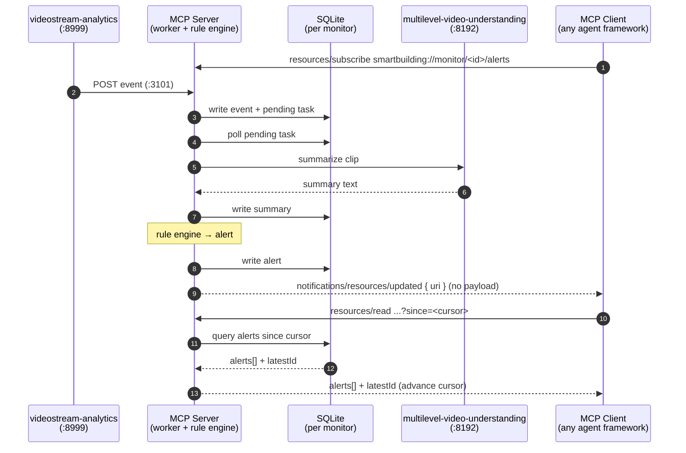

# Agentic Smart Community

An AI-agent-native video analysis platform built on the **MCP (Model Context Protocol)**. It hands AI agents a universal, framework-agnostic toolkit for video surveillance and analysis, so they can autonomously create, manage, and respond to custom use cases — with no changes to core components.

Concretely, an agent can remind you when the fridge is running low on groceries, alert a parent the instant a child climbs onto a window sill, or flag when an elderly family member hasn't gotten up on time — and you can add a brand-new use case just by describing it in chat.

> **New here?** Bring the stack up in a few commands with the **[Get Started Guide](./get-started.md)**.

## Example Use Cases

These demos are validated end-to-end. They are only a starting point — describe a new scenario in chat and trigger a new use case monitoring following (`TODO: how-to-register-new-use-cases`).

| Use Case | Description | Proactive Alerts |
|----|-------------|-----|
| Fridge Monitor | Refrigerator monitoring — regular reports (food shortage alerts, diet adjustment suggestions, lifestyle/fitness recommendations) + interactive chat with agents for personalized Q&A | No |
| Child Safety | Child danger alert notification — real-time detection of risky behaviors (jumping from heights, playing with knives/fire, etc.), immediate alerts to parents, daily summaries, and follow-up conversations | Yes |
| Elder Wakeup | Elder care (wake-up tracking) — monitor daily wake-up times, alert caregivers on significant deviations, weekly summary reports, and follow-up reminders | Yes |

## Overall Architecture

The platform is built around MCP, letting AI agents (OpenClaw, Hermes, etc.) orchestrate video analysis pipelines through standardized tool interfaces.

It uses a layered design with clearly separated, decoupled responsibilities — top to bottom: the **Agent Workspace** (personas + skills), the **MCP Server** (tool surface, rule engine, alert resources), the dependent **video services** (stream analytics, video understanding, VLM), and the underlying **client** that feeds and consumes the stream.


**Figure: Smart Building Video Analytics — Overall Architecture**

## How It Works

Where the Overall Architecture shows *how the layers stack*, this section shows *what an agent actually works with*. Three pieces make the platform framework-agnostic:

- **MCP Server Workflow** — the runtime that orchestrates the video pipeline and turns rule-engine decisions into subscribable alert resources.
- **MCP Tools** — the standardized tool surface every agent calls to query, report, and manage monitors and use cases.
- **Agent Skills** — the portable know-how that teaches an agent how to use those tools and how to author brand-new use cases.

### MCP Server Workflow

The MCP server sits between AI agents and the dependent external services:

```
                  agents (OpenClaw / Hermes / Claude Desktop)
                                  │  MCP tools
                                  ▼
        ┌────────────────────────────────────────────────────┐
        │                 MCP Server  :3100                  │ ◀── config.yaml
        └───────┬─────────────────────────────────┬──────────┘      + monitors.yaml
                │  /register_source :8999  ↓      │  /summary :8192
                │  /events :3101           ↑      │
                ▼                                 ▼
        videostream-analytics            multilevel-video-understanding
        (recording + prefilter)          (video summary + report)
```

#### Lifecycle

- **Startup**: load config → init DB → open MCP transport (`:3100/mcp`) + events webhook (`:3101`) → reconcile crash residue → auto-register monitors → start storage cleaner + keepalive heartbeat.
- **Runtime**: the per-monitor data flow below.
- **Shutdown** (SIGINT/SIGTERM): stop cleaner/keepalive → graceful-stop workers → pause analytics sources → close DB.

#### Runtime Data Flow

Per monitor: the video pipeline drives events into the server, the worker summarizes clips, the rule engine decides alerts, and any subscribed MCP client is delivered those alerts through the **standard MCP resource-subscription protocol** — no framework-specific coupling.

A client (OpenClaw, Hermes, Claude Desktop, …) subscribes to `smartbuilding://monitor/<id>/alerts`; the push carries only the URI, and the client pulls new alerts with a `?since=<cursor>` incremental read (at-least-once, cursor-deduped).



### MCP Tools

The server exposes a standardized, use-case-agnostic tool surface (every id prefixed `smartbuilding_`). Agents drive the whole platform through these — no custom code per use case. All tools are keyed on `monitor_id`.

| Group | Tools | What it does |
|---|---|---|
| **Query & report** | `alert_query` · `scene_query` · `generate_report` · `video_db` | Read/ack alerts, one-shot VLM look at the live frame, build period reports, raw read-only SQL |
| **Monitor lifecycle** | `monitor_ctl` · `monitors_compose` | Register/start/stop a single monitor; docker-compose-style batch over a `monitors.yaml` |
| **Use-case authoring** | `use_case_validate` · `use_case_register` | Validate a use case is wired end-to-end, register/unregister one at runtime |
| **Rules & plans** | `plan_ctl` · `rule_eval` | Per-monitor JSON plans; manual replay of the rule evaluator (alerts normally fire automatically) |

See the full reference — parameters, `action` enums, return shapes, the SQLite data model, and the data directory layout — in **[MCP Tools Reference](./get-started/mcp_tools_list.md)**.

### Agent Skills

Skills are portable Markdown guides (framework-agnostic; usable by any MCP client) that turn the raw tool surface into repeatable recipes. Two ship today, mirroring the two halves of the platform — *operating* monitors and *creating* use cases.

| Skill | Purpose | Anchored on |
|---|---|---|
| **[`smartbuilding-toolkit`](../../skills/smartbuilding-toolkit/SKILL.md)** | Operate the platform: the full `smartbuilding_*` tool catalog, the SQLite data model, how to discover which monitor to act on, how reports are generated, how pushed alerts reach a session, and which actions are destructive (two-phase confirm). | the MCP tools + resources |
| **[`video-summary-prompt-studio`](../../skills/video-summary-prompt-studio/SKILL.md)** | Create a new use case conversationally — just chat with the agent to describe it, and the skill infers the events/schema, drafts the prompt, and registers the task for you. | multilevel-video-understanding task registration |

Together they close the loop: `video-summary-prompt-studio` **creates** a use case, then `smartbuilding-toolkit` **runs** it — no core-component changes in between.

## Supporting Resources

- [Get Started Guide](./get-started.md)
- [API Reference](./api-reference.md)
- [System Requirements](./get-started/system-requirements.md)
- [Release Notes](./release-notes.md)

## License

See [LICENSE](LICENSE).
