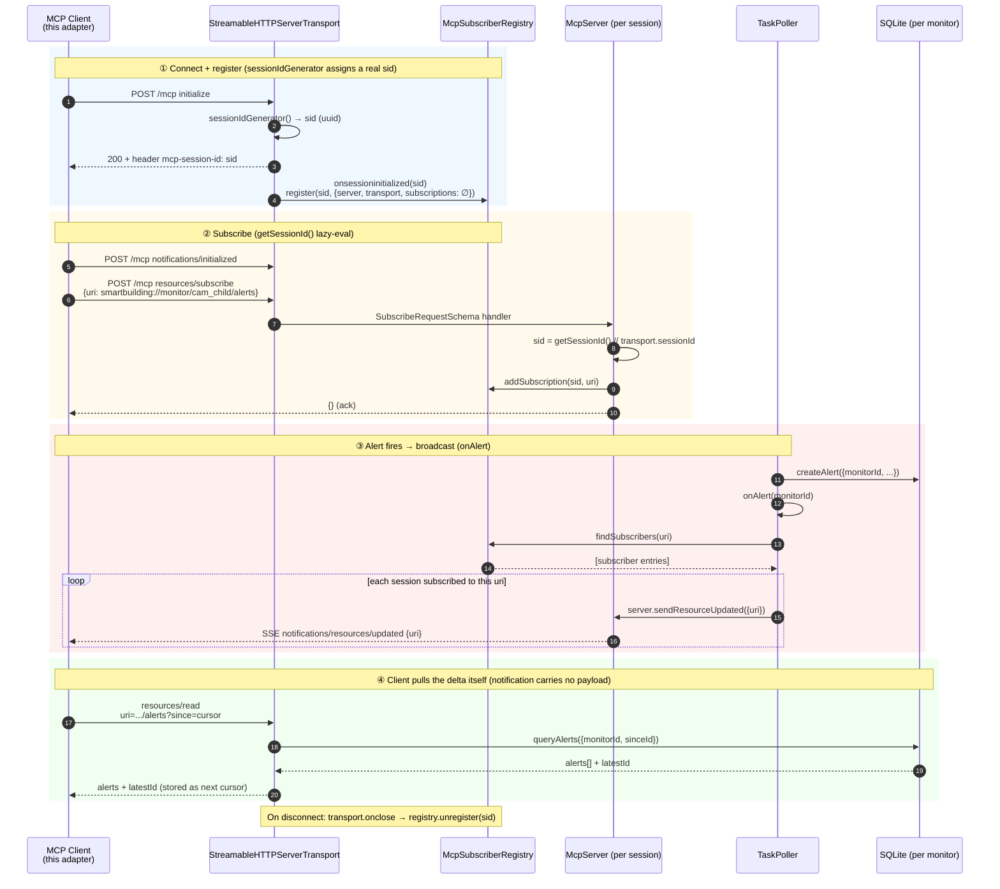

# Adapter Example: Smart Community MCP × OpenClaw

A production-ready OpenClaw plugin that subscribes to the **Smart Community (SmartBuilding) MCP
server**'s per-monitor alert resources and injects each new alert into the routed OpenClaw
session(s). It is the reference implementation of a **framework adapter** built on
[`@smartbuilding-video/framework-adapter-sdk`](../../).

## What this integrates

The Smart Community MCP server is **host-agnostic** — it knows nothing about OpenClaw, Feishu, or
agent sessions. When its rule engine fires an alert it only emits the protocol-standard
`notifications/resources/updated` (uri only, no payload). This plugin is the bridge that turns those
notifications into chat turns inside OpenClaw:

- It runs the SDK's long-lived MCP client (subscribe, cursor dedup, per-monitor ordering, reconnect).
- It owns the **route table** (`monitor → OpenClaw session[]`) — the MCP server has no concept of
  sessions, so routing lives here in plugin config.
- It does **raw pass-through** — no embedded rule engine, no persona polish. The SDK owns the
  protocol; the plugin just appends each alert into the target session.

This is the light **MCP-subscribe + raw pass-through** path. The result: a monitor alert appears in
the agent's chat session as if the user had spoken it, driving both proactive notifications and
reactive follow-up Q&A from the same transcript.

## Architecture

```
   Video pipeline + rule engine
   (per-monitor alerts)
             │
             ▼
   ┌──────────────────────┐       notifications/resources/updated       ┌───────────────────────────┐
   │  Smart Community MCP  │  ─────────────── (uri only) ─────────────▶  │   Adapter  (this plugin)   │
   │       server          │                                             │  ┌──────────────────────┐ │
   │   (host-agnostic)     │  ◀──── resources/read ?since=<cursor> ────  │  │ MCP client (SDK)     │ │
   └──────────────────────┘  ──────────── alerts[] + latestId ────────▶  │  │ subscribe · dedup ·  │ │
                                                                         │  │ order · reconnect    │ │
                                                                         │  └──────────┬───────────┘ │
                                                                         │  ┌──────────▼───────────┐ │
                                                                         │  │ route table          │ │
                                                                         │  │ monitor → session[]  │ │
                                                                         │  └──────────┬───────────┘ │
                                                                         └─────────────┼─────────────┘
                                                                                       │ append alert turn
                                                                                       ▼
                                                                          OpenClaw agent sessions
                                                                       (proactive push + follow-up Q&A)
```

The adapter is a thin, long-lived bridge: the MCP server decides *what* is an alert, the adapter
decides *where* it goes. It carries no rules and no persona — an alert lands in the target session
verbatim, as if the user had typed it, so the same transcript serves both the proactive push and the
user's follow-up questions.

Each route can be delivered in one of two modes (see `deliver` in [Configure](#configure)):
**`deliver:false`** injects the alert straight into the OpenClaw session with zero LLM;
**`deliver:true`** additionally relays it out through an external channel. The lower-level injection
mechanics (transcript API vs. legacy FS-append, idempotency, write locking) are handled by the SDK
and documented in the source under `src/`.

## Get Started Guide

### 0. Bring up the host-agnostic core first

This adapter only wires an already-running MCP server into OpenClaw — it does **not** start the
video pipeline itself. Before installing it, follow
[**Get Started**](../../../../docs/user-guide/get-started.md) to bring up the core:

- the three core services (`vllm-ipex-serving` :41091, `multilevel-video-understanding` :8192,
  `videostream-analytics`),
- the demo video RTSP streams (`live/fridge`, `live/child`, `live/elder`),
- the **MCP server** on Streamable-HTTP `:3100/mcp` + events webhook `:3101`.

Come back here once `curl http://localhost:3100/mcp` responds and the demo monitors are running.
The remaining steps are OpenClaw-specific.

### 1. Install plain OpenClaw

Follow [`scripts/openclaw/README.md`](../../../../scripts/openclaw/README.md) to install the pure OpenClaw.

### 2. *(optional)* Fire model providers

On a fresh machine you still need model providers wired into `~/.openclaw/openclaw.json`. The dev
convenience script re-applies this machine's providers (a local vLLM + minimax cloud):

```bash
bash packages/framework-adapter-sdk/examples/openclaw/scripts/fire_models.sh
```

### 3. Register the MCP server in OpenClaw

The MCP server is already running from [Get Started](../../../../docs/user-guide/get-started.md).
Register it in `~/.openclaw/openclaw.json` as a Streamable-HTTP MCP server:

```json
{
  "mcp": {
    "servers": {
      "smart-community": {
        "transport": "streamable-http",
        "url": "http://localhost:3100/mcp"
      }
    }
  }
}
```
Then restart the openclaw:
```bash
openclaw gateway restart
```

Verify the connection:

```bash
openclaw mcp probe smart-community
# → smart-community: X tools, resources
```

### 4. Install this framework adapter (the plugin)

```bash
cd packages/framework-adapter-sdk/examples/openclaw
bash install.sh
```

That fully installs the adapter — no manual `openclaw.json` editing required. It:

1. builds the SDK and installs the plugin's deps,
2. registers the plugin entry in `openclaw.json`,
3. merges the demo agents into `agents.list[]` (merge-by-id — never clobbers agents you added),
4. links the plugin into `~/.openclaw/extensions/smartbuilding-alerts`,
5. seeds the bundled agent personas into `~/.openclaw/agents/`,
6. restarts the OpenClaw gateway (`openclaw gateway restart`),
7. wakes the demo agents (`openclaw agent -m hi`) so their sessions exist.

### 5. What you can do once it's running

Forward the gateway port from your local machine and open the OpenClaw dashboard UI:

```bash
ssh -L 18789:127.0.0.1:18789 user@host-ip
```

Then browse to the dashboard locally. You'll see **3 agents**; the `cam_child` and
`cam_elder_bedroom` sessions receive live alert pushes as the pipeline fires events.

The database on the service host lives at `~/.mcp-smartbuilding/smartbuilding.db`.

## Configure

`install.sh` writes this into `plugins.entries.smartbuilding-alerts` of
`~/.openclaw/openclaw.json` — you normally don't edit it by hand:

```json
"smartbuilding-alerts": {
  "enabled": true,
  "config": {
    "mcpServer": { "url": "http://localhost:3100/mcp" },
    "monitors": {
      "cam_child": {
        "alerts": [
          { "agentId": "child-safety-agent", "sessionKey": "agent:child-safety-agent:cam_child", "deliver": false }
        ]
      },
      "cam_elder_bedroom": {
        "alerts": [
          { "agentId": "elder-wakeup-agent", "sessionKey": "agent:elder-wakeup-agent:cam_elder_bedroom", "deliver": false }
        ]
      }
    }
  }
}
```

| Field | Meaning |
|-------|---------|
| `mcpServer.url` | SmartBuilding MCP endpoint (Streamable HTTP). `mcpServer.headers` for auth if needed. |
| `monitors.<id>.alerts[]` | Where this monitor's alerts go. `<id>` maps to `smartbuilding://monitor/<id>/alerts`. |
| `agentId` | Agent owning the target session (resolves the JSONL path for FS-append). |
| `sessionKey` | Target OpenClaw session key, `agent:<agentId>:<session>`. The examples route each monitor into its own session (`…:cam_child`), so alerts don't mix with the agent's `main` chat. |
| `deliver` | `false` (default) → inject the alert turn into the session, zero LLM. `true` → channel delivery via `subagent.run` (e.g. a Feishu group session) — *not yet verified end-to-end*. `deliver` no longer selects the write mechanism (both share the same session-injection primitive); it only decides whether to *also* push to an external channel. |
| `cursorFile` | *(optional)* delivery cursor path. Default `<OPENCLAW_HOME>/smartbuilding-alerts-cursor.json`. |
| `pollFallbackMs` | *(optional)* safety-net poll (ms) against a lost notification. Default `0` (off). |

> **Adding another monitor or agent:**
Add a `monitors.<id>` entry and (if new) seed the agent's personas under `~/.openclaw/agents/<id>/`.
No code change is needed — the adapter subscribes to whatever monitor ids appear in config.

## Subscription data flow

The runtime subscription sequence — connect, subscribe, alert broadcast, cursor read — end to end



- **① Connect** — the adapter's MCP client initializes; the server's stateful HTTP transport mints a
  real `mcp-session-id` and registers it in the `McpSubscriberRegistry`.
- **② Subscribe** — the adapter subscribes to each configured monitor's `…/alerts` URI *before* its
  first read, so no notification is lost in the startup window (cursor dedup covers the overlap).
- **③ Broadcast** — when the rule engine's `TaskPoller` creates an alert, `onAlert` looks up every
  session subscribed to that URI and pushes a payload-less `notifications/resources/updated` over SSE.
- **④ Delta read** — on notification the adapter reads `…/alerts?since=<cursor>`, gets the new alerts
  plus a fresh `latestId`, advances its cursor atomically after all sinks succeed (at-least-once),
  and appends each alert into the routed OpenClaw session.
