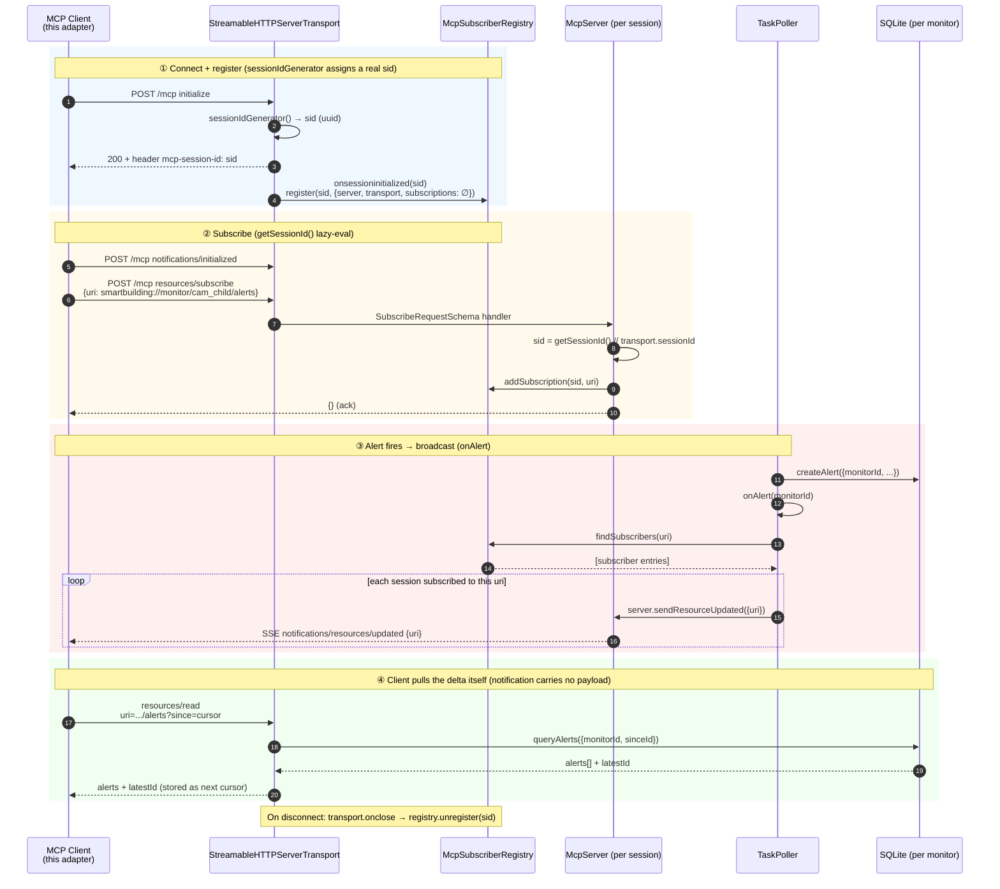

# Adapter Example: Smart Community MCP × OpenClaw

A production-ready OpenClaw plugin that subscribes to the **Smart Community MCP server**'s per-monitor alert resources and injects each new alert into the routed OpenClaw session(s).
It is the reference implementation of a **framework adapter** built on [`@smartbuilding-video/framework-adapter-sdk`](../../).

## What this integrates

The Smart Community MCP server is **host-agnostic** — it knows nothing about OpenClaw, Feishu, or agent sessions.
When its rule engine fires an alert it only emits the protocol-standard `notifications/resources/updated` (uri only, no payload).
This plugin is the bridge that turns those notifications into chat turns inside OpenClaw:

- It runs the SDK's long-lived MCP client (subscribe, cursor dedup, per-monitor ordering, reconnect).
- It owns the **route table** (`monitor → OpenClaw session[]`) — the MCP server has no concept of sessions, so routing lives here in plugin config.
- It does **raw pass-through** — no embedded rule engine, no persona polish; the SDK owns the protocol, the plugin just appends each alert into the target session.

This is the light **MCP-subscribe + raw pass-through** path.
The result: a monitor alert appears in the agent's chat session as if the user had spoken it, driving both proactive notifications and reactive follow-up Q&A from the same transcript.

## Architecture

```
   Video pipeline + rule engine
   (per-monitor alerts)
             │
             ▼
   ┌──────────────────────┐       notifications/resources/updated       ┌───────────────────────────┐
   │  Smart Community MCP  │  ─────────────── (uri only) ─────────────▶  │   Adapter  (this plugin)   │
   │       server          │                                             │  ┌──────────────────────┐ │
   │   (host-agnostic)     │  ◀──── resources/read ?since=<cursor> ────  │  │ MCP client (SDK)     │ │
   └──────────────────────┘  ──────────── alerts[] + latestId ────────▶  │  │ subscribe · dedup ·  │ │
                                                                         │  │ order · reconnect    │ │
                                                                         │  └──────────┬───────────┘ │
                                                                         │  ┌──────────▼───────────┐ │
                                                                         │  │ route table          │ │
                                                                         │  │ monitor → session[]  │ │
                                                                         │  └──────────┬───────────┘ │
                                                                         └─────────────┼─────────────┘
                                                                                       │ append alert turn
                                                                                       ▼
                                                                          OpenClaw agent sessions
                                                                       (proactive push + follow-up Q&A)
```

The adapter is a thin, long-lived bridge: the MCP server decides *what* is an alert, the adapter decides *where* it goes.
It carries no rules and no persona — an alert lands in the target session verbatim, as if the user had typed it, so the same transcript serves both the proactive push and the user's follow-up questions.

Each route can be delivered in one of two modes (see `deliver` in [Configure](#configure)): **`deliver:false`** injects the alert straight into the OpenClaw session with zero LLM; **`deliver:true`** additionally relays it out through an external channel.
The lower-level injection mechanics (transcript API vs. legacy FS-append, idempotency, write locking) are handled by the SDK and documented in the source under `src/`.

## Get Started Guide

> **Where this fits.** Arrive here from [Get Started → Connect an agent host → OpenClaw](../../../../docs/user-guide/get-started.md#openclaw) with these already done:
>
> - [x] core up (services + demo streams + MCP server)
> - [x] OpenClaw installed
> - [x] `smart-community` MCP server registered in `openclaw.json`
> - [x] skills imported
>
> That gives you the **reactive** demo (agent calls a tool when you ask). This optional adapter adds the **full** demo:
>
> - **Proactive alerts** — each monitor's alerts pushed into its agent session, no need to ask.
> - **Dedicated agent per monitor**.

### 1. *(optional, dev only)* Wire model providers

On a fresh machine OpenClaw still needs model providers in `~/.openclaw/openclaw.json`.
This dev convenience script re-applies this machine's providers (a local vLLM + minimax cloud):

```bash
cd ~/edge-ai-suites/metro-ai-suite/agentic-smart-community/packages/framework-adapter-sdk/examples/openclaw
bash scripts/fire_models.sh
```

### 2. Install the adapter plugin

```bash
cd ~/edge-ai-suites/metro-ai-suite/agentic-smart-community/packages/framework-adapter-sdk/examples/openclaw
bash scripts/install.sh
```

That fully installs the adapter — no manual `openclaw.json` editing required. It:

1. builds the SDK and installs the plugin's deps,
2. registers the plugin entry in `openclaw.json`,
3. merges the demo agents into `agents.list[]` (merge-by-id — never clobbers agents you added),
4. links the plugin into `~/.openclaw/extensions/smartbuilding-alerts`,
5. installs the repo's skills into `~/.openclaw/skills/` (discovered natively by OpenClaw),
6. seeds the bundled agent personas into `~/.openclaw/agents/`,
7. restarts the OpenClaw gateway (`openclaw gateway restart`),
8. wakes the demo agents (`openclaw agent -m hi`) so their sessions exist.

### 3. *(optional)* Set your cron tasks

The **scheduled** side — daily / weekly reports and the elder-wakeup fallback — is driven by OpenClaw cron jobs. Four jobs reproduce the smarthome POC's scheduled behavior.

Add them with `openclaw cron add`, which writes straight into `~/.openclaw/cron/jobs.json` (no hand-editing JSON). Here are some typical scheduled cron task:

#### Overview

| Job | Schedule (cron) | When | Agent | Session key | Purpose |
|-----|-----------------|------|-------|-------------|---------|
| `fridge-daily-report-22` | `0 22 * * *` | Daily 22:00 | `fridge-agent` | `agent:fridge-agent:daily_report` | Daily fridge report: open/close events, ingredient summary, points of concern |
| `child-safety-daily-22` | `30 22 * * *` | Daily 22:30 | `child-safety-agent` | `agent:child-safety-agent:daily_report` | Five-section child-safety report (overview / danger-event breakdown / most critical event / recommendations / trend) |
| `elder-wakeup-weekly-22` | `0 22 * * 0` | Sunday 22:00 | `elder-wakeup-agent` | `agent:elder-wakeup-agent:weekly_report` | Weekly wakeup report for the last 7 days (Mon 00:00–Sun 23:59), four sections (weekly overview / daily timeline / late_wakeup·no_wakeup analysis / trend) |
| `elder-wakeup-fallback-10` | `0 10 * * *` | Daily 10:00 | `elder-wakeup-agent` | `agent:elder-wakeup-agent:cam_elder_bedroom` | No-wakeup fallback: if no `get_up` by 10:00 → `scene_query` to recheck whether the bed is occupied → emit a `no_wakeup` alert if still in bed |

> `late_wakeup` vs `no_wakeup`: `late_wakeup` means the person got up but later than the expected baseline; `no_wakeup` means they still had not gotten up by the fallback time.

#### Commands

Run these one at a time in a terminal on the Gateway host:

```bash
# Job 1 — Fridge daily report (daily 22:00)
openclaw cron add \
  --name fridge-daily-report-22 \
  --cron "0 22 * * *" \
  --tz Asia/Shanghai \
  --agent fridge-agent \
  --session "session:daily_report" \
  --session-key agent:fridge-agent:daily_report \
  --no-deliver \
  --message "Generate today's fridge daily report, covering the day's open/close events, an ingredient summary, and any points of concern."

# Job 2 — Child-safety daily report (daily 22:30)
openclaw cron add \
  --name child-safety-daily-22 \
  --cron "30 22 * * *" \
  --tz Asia/Shanghai \
  --agent child-safety-agent \
  --session "session:daily_report" \
  --session-key agent:child-safety-agent:daily_report \
  --no-deliver \
  --message "Generate today's child-safety daily report covering all alerts and scene changes, in five sections: overview / danger-event breakdown / most critical event / recommendations / trend."

# Job 3 — Elder wakeup weekly report (Sunday 22:00)
openclaw cron add \
  --name elder-wakeup-weekly-22 \
  --cron "0 22 * * 0" \
  --tz Asia/Shanghai \
  --agent elder-wakeup-agent \
  --session "session:weekly_report" \
  --session-key agent:elder-wakeup-agent:weekly_report \
  --no-deliver \
  --message "Generate this week's elder wakeup report for the last 7 days (Mon 00:00 to Sun 23:59): call daily_report with source_id=cam_elder_bedroom, summarizing each day's wakeup time, deviation from baseline, and late_wakeup/no_wakeup alert counts and trend, in four sections: weekly overview / daily timeline / late_wakeup and no_wakeup analysis / trend recommendations."

# Job 4 — Elder no-wakeup fallback alert (daily 10:00)
openclaw cron add \
  --name elder-wakeup-fallback-10 \
  --cron "0 10 * * *" \
  --tz Asia/Shanghai \
  --agent elder-wakeup-agent \
  --session "session:cam_elder_bedroom" \
  --session-key agent:elder-wakeup-agent:cam_elder_bedroom \
  --no-deliver \
  --message "If no get_up event has been observed by 10:00: use scene_query to recheck whether someone is still in bed; if the bed is still occupied, emit a no_wakeup alert (distinct from late_wakeup: late_wakeup means already up but later than expected, no_wakeup means not up at all)."
```

#### Verify

```bash
openclaw cron list                       # confirm all four jobs are present and enabled
openclaw cron rm  <job-id>               # remove a job to redo it — takes the id from `cron list`, not the name
```
> - Try trigger the cron job mannually from the Openclaw control UI (:18789)
> - Once configured, you will receive the on-time cron delivering in the specified session. Open the session from Openclaw control UI.

### 3. What you get

Open the OpenClaw dashboard UI:

```bash
openclaw dashboard

# Dashboard URL: http://127.0.0.1:18789/
```
> To log-in, find your gateway token from `openclaw.json`

You'll see **3 agents**; the `cam_child` and `cam_elder_bedroom` sessions receive live alert pushes as the pipeline fires events.

The database on the service host lives at `~/.mcp-smartbuilding/smartbuilding.db`.

## Learn More

### Plugin configuration description

`scripts/install.sh` writes this into `plugins.entries.smartbuilding-alerts` of `~/.openclaw/openclaw.json` — you normally don't edit it by hand:

```json
"smartbuilding-alerts": {
  "enabled": true,
  "config": {
    "mcpServer": { "url": "http://localhost:3100/mcp" },
    "monitors": {
      "cam_child": {
        "alerts": [
          { "agentId": "child-safety-agent", "sessionKey": "agent:child-safety-agent:cam_child", "deliver": false }
        ]
      },
      "cam_elder_bedroom": {
        "alerts": [
          { "agentId": "elder-wakeup-agent", "sessionKey": "agent:elder-wakeup-agent:cam_elder_bedroom", "deliver": false }
        ]
      }
    }
  }
}
```

| Field | Meaning |
|-------|---------|
| `mcpServer.url` | SmartBuilding MCP endpoint (Streamable HTTP). `mcpServer.headers` for auth if needed. |
| `monitors.<id>.alerts[]` | Where this monitor's alerts go. `<id>` maps to `smartbuilding://monitor/<id>/alerts`. |
| `agentId` | Agent owning the target session (resolves the JSONL path for FS-append). |
| `sessionKey` | Target OpenClaw session key, `agent:<agentId>:<session>`. The examples route each monitor into its own session (`…:cam_child`), so alerts don't mix with the agent's `main` chat. |
| `deliver` | `false` (default) → inject the alert turn into the session, zero LLM. `true` → channel delivery via `subagent.run` (e.g. a Feishu group session) — *not yet verified end-to-end*. `deliver` no longer selects the write mechanism (both share the same session-injection primitive); it only decides whether to *also* push to an external channel. |
| `cursorFile` | *(optional)* delivery cursor path. Default `<OPENCLAW_HOME>/smartbuilding-alerts-cursor.json`. |
| `pollFallbackMs` | *(optional)* safety-net poll (ms) against a lost notification. Default `0` (off). |

> **Adding another monitor or agent:**
> Add a `monitors.<id>` entry and (if new) seed the agent's personas under `~/.openclaw/agents/<id>/`.
> No code change is needed — the adapter subscribes to whatever monitor ids appear in config.

### Subscription data flow

The runtime subscription sequence — connect, subscribe, alert broadcast, cursor read — end to end



- **① Connect** — the adapter's MCP client initializes; the server's stateful HTTP transport mints a real `mcp-session-id` and registers it in the `McpSubscriberRegistry`.
- **② Subscribe** — the adapter subscribes to each configured monitor's `…/alerts` URI *before* its first read, so no notification is lost in the startup window (cursor dedup covers the overlap).
- **③ Broadcast** — when the rule engine's `TaskPoller` creates an alert, `onAlert` looks up every session subscribed to that URI and pushes a payload-less `notifications/resources/updated` over SSE.
- **④ Delta read** — on notification the adapter reads `…/alerts?since=<cursor>`, gets the new alerts plus a fresh `latestId`, advances its cursor atomically after all sinks succeed (at-least-once), and appends each alert into the routed OpenClaw session.
